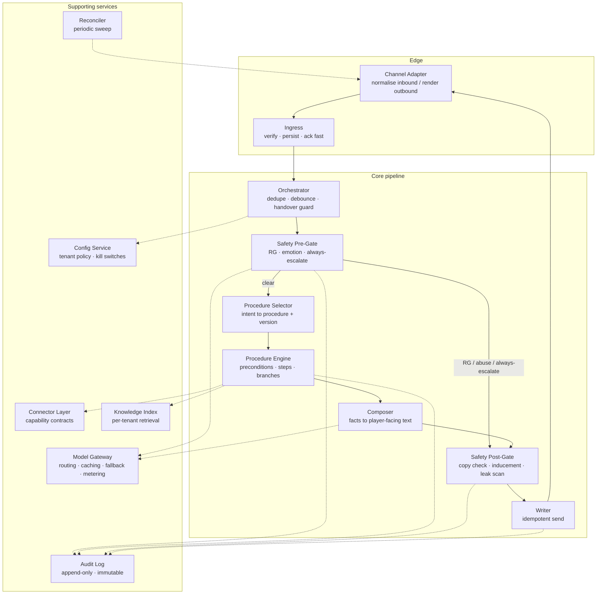
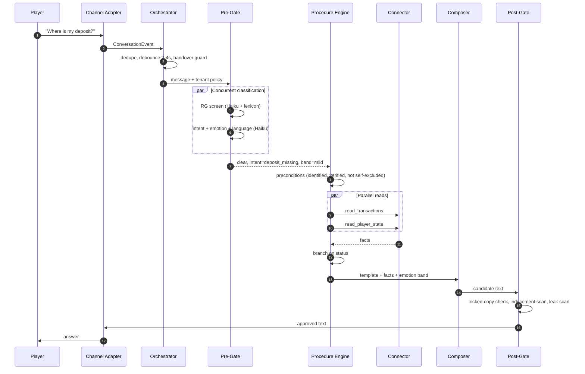
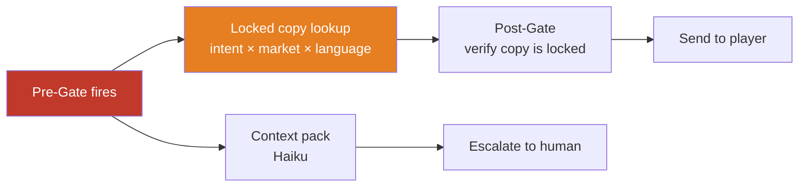
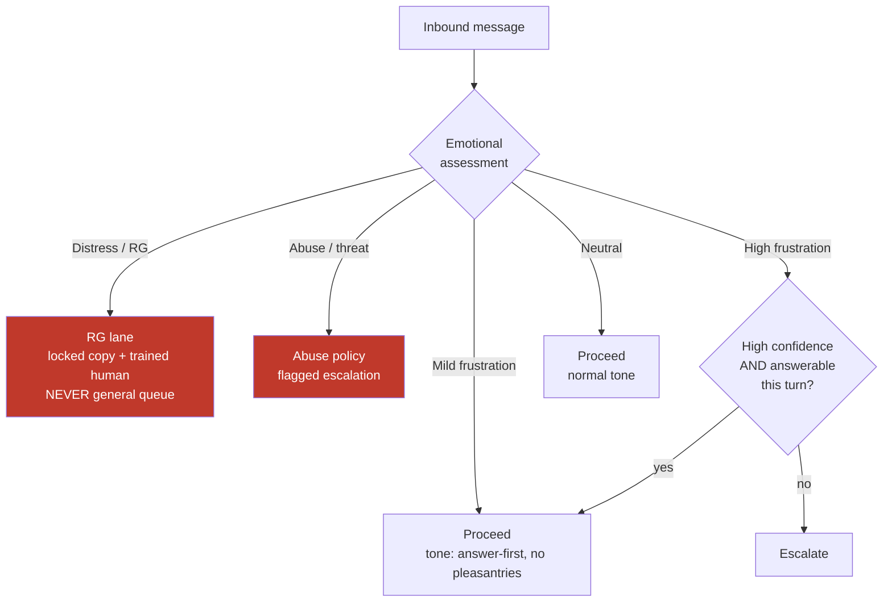
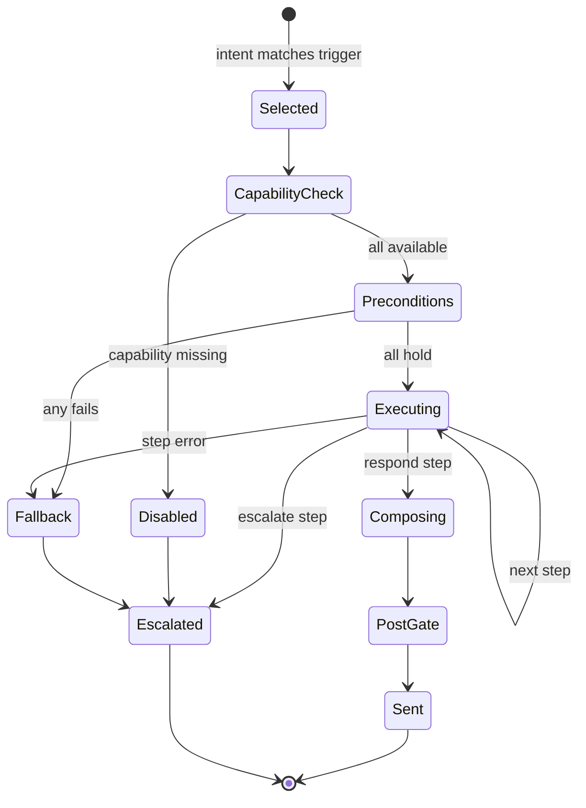
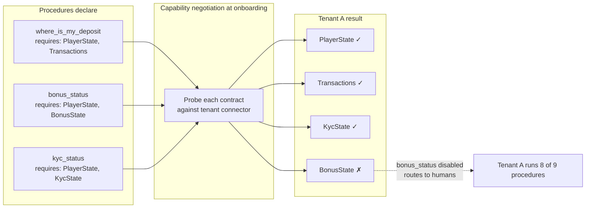
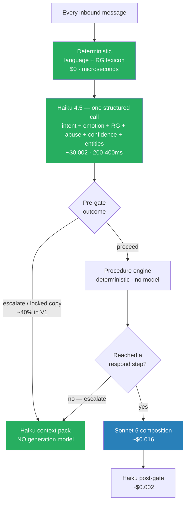
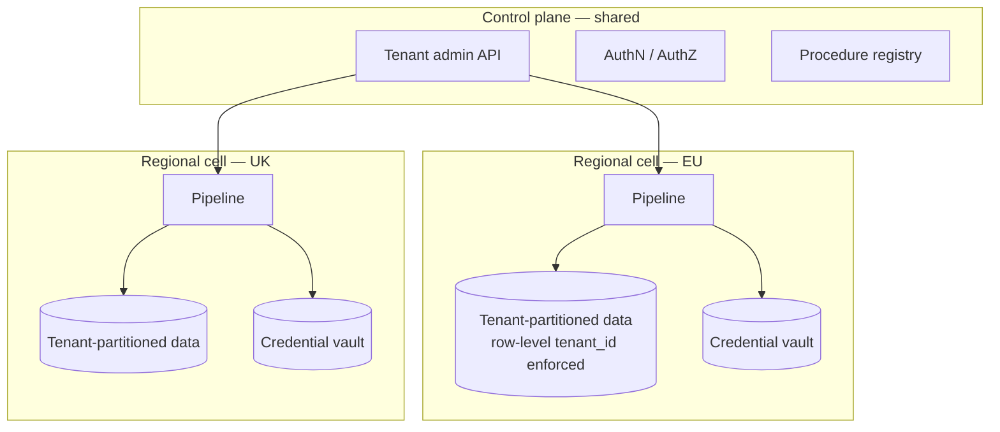

# IGamingSupportAgent — Design Document

**Draft v1.0 · 13 August 2026**

Technical design for a multi-tenant SaaS AI support agent for iGaming operators.

**Companion document:** `Requirements.md` v0.2. Every design decision here traces to an `FR-` or `NFR-` identifier in that document. Where this design diverges or adds detail, it says so explicitly.

---

## Table of contents

| Part | Section |
|---|---|
| 1 | Scope and design principles |
| 2 | System architecture |
| 3 | Request lifecycle |
| 4 | Safety gates |
| 5 | Procedure engine |
| 6 | Connector layer |
| 7 | Knowledge and retrieval |
| 8 | **Model strategy — which model does what** |
| 9 | Multi-tenancy and isolation |
| 10 | State and data model |
| 11 | Observability |
| 12 | Cost model |
| 13 | Forward compatibility (V2, V3) |
| 14 | Risks |
| 15 | Competitive landscape and references |

---

# Part 1 — Scope and design principles

## 1.1 What this design builds

| Decision | Choice | Traces to |
|---|---|---|
| Tenancy | Multi-tenant SaaS | Requirements §1.1 |
| V1 authority | Read and answer only; no writes to operator systems | Requirements §1.1 |
| Channels | Abstracted behind an adapter layer; specific channels deferred | FR-78 |
| Control flow | Deterministic procedure engine; model classifies and phrases | §1.2 below |

## 1.2 Three principles

**P1 — The procedure decides what happens; the model decides what it says.**

The model never chooses to touch player data. A procedure selects the reads, the engine executes them, and the model is handed a fixed set of facts to phrase. This makes preconditions provable rather than promised, and it is the sentence that satisfies a compliance officer.

**P2 — Safety gates live outside the procedure engine.**

RG screening, emotional assessment, and always-escalate detection run in the pipeline, before procedure selection. If they were procedure *steps*, an unauthored path would silently drop coverage — and FR-47 requires 100%. A post-gate validates every outbound message before it reaches a player.

**P3 — Connectors are capability contracts, not integrations.**

Each read step is backed by a declared capability. A tenant's connector implements what that operator can actually supply; procedures declare what they require; unmet capabilities disable the procedure for that tenant rather than failing mid-conversation.

---

# Part 2 — System architecture

## 2.1 Component overview



## 2.2 Component responsibilities

| Component | Responsibility | Requirement |
|---|---|---|
| **Channel Adapter** | Normalise inbound events to a canonical `ConversationEvent`; render outbound per channel | FR-78 |
| **Ingress** | Verify signature, persist raw event, enqueue, acknowledge fast | FR-79 |
| **Orchestrator** | Dedupe, debounce, load tenant policy, enforce handover stickiness | FR-19, FR-36, FR-42 |
| **Safety Pre-Gate** | RG screening, emotional band, abuse, always-escalate — authority to pre-empt | FR-26–35, FR-47–51 |
| **Procedure Selector** | Map primary intent to procedure + version; check capability availability | FR-10, FR-13 |
| **Procedure Engine** | Execute preconditions and steps; branch; record every step | FR-1–12 |
| **Composer** | Turn step outputs into player-facing text under an approved template | FR-33 |
| **Safety Post-Gate** | Validate outbound before send | FR-45 |
| **Writer** | Idempotent send keyed to the triggering inbound message | FR-42 |
| **Model Gateway** | Sole egress for model calls: routing, caching, timeouts, fallback, token metering | Part 8 |
| **Connector Layer** | Capability-contracted access to operator systems | FR-10, FR-73 |
| **Knowledge Index** | Per-tenant retrieval over operator content | FR-54–56 |
| **Config Service** | Per-tenant policy, thresholds, copy, kill switches | FR-74, FR-76 |
| **Audit Log** | Append-only record of every decision | NFR-22–24 |
| **Reconciler** | Periodic sweep for missed events | FR-80 |

**Why the Writer is separate:** it is the only component that mutates the player-visible world. Idempotency, rate limiting, and the kill switch belong at exactly one chokepoint.

---

# Part 3 — Request lifecycle

## 3.1 Happy path



## 3.2 Pre-gate escalation path

When the pre-gate fires, the procedure engine never runs. This is structural, not conditional — the code path from pre-gate to composer does not exist.



**Zero generated text reaches the player on this path** (FR-51). The only model call is the human-facing context pack.

---

# Part 4 — Safety gates

## 4.1 Pre-gate: order of authority

Evaluated on every inbound message, before anything else. Order matters — a distressed player often *reads* as frustrated, and routing them to the general queue instead of the RG path is the failure that costs a licence.

| Priority | Check | Action | Requirement |
|---|---|---|---|
| 1 | Kill switch (tenant or global) | Escalate immediately; keep ingesting and logging | FR-76 |
| 2 | Conversation state: closed, handed over, suppressed | Decline | FR-36 |
| 3 | Self-excluded / cooling-off (from identity resolution) | Distinct RG policy — never a standard flow | FR-17 |
| 4 | **RG / distress signal** | Locked copy + trained human. **Pre-empts everything below.** | FR-47–49 |
| 5 | Abuse or threat | Distinct policy, flagged | FR-29 |
| 6 | Always-escalate intent set | Locked acknowledgement copy + escalate | FR-50, FR-51 |
| 7 | Explicit request for a human | Immediate escalation, no deflection | FR-38 |
| 8 | Auto-reply ceiling reached | Escalate | FR-40 |
| 9 | Emotional band | Modulate (see 4.2) | FR-27 |
| 10 | Confidence below threshold | Escalate | FR-22 |

Checks 1–3 and 7–8 are deterministic and cost nothing. Only 4–6 and 9–10 consume model tokens, and they share a single call (Part 8).

## 4.2 Emotional band routing

Emotion modulates behaviour across five bands rather than acting as a binary switch. In iGaming, mild frustration is the baseline — a binary "frustrated → human" rule escalates most inbound volume and destroys the automation rate, and an accurate instant answer is often the fastest de-escalation available.



Two signals matter more than the absolute band:

- **Trajectory** (FR-30) — a rising slope across turns predicts "a human should take this" better than any single reading. A calm third contact about the same deposit outranks one angry first contact.
- **Availability** (FR-32) — escalating into an empty queue at 3am produces silence, the exact failure we are designing against. The router reads staffing state and, where no human is on shift, attempts the answer with honest disclosure of the wait.

The band also reaches the Composer (FR-33). Detecting frustration and replying in default chirpy voice is worse than not detecting it.

**Calibration risk:** sentiment models degrade badly outside English, and ordinary directness in German or Dutch reads as anger to a model trained on English politeness norms. Thresholds are per-tenant *and per-market* (FR-34), with per-language accuracy monitoring (FR-35).

## 4.3 Post-gate

Cheap, and it is how "always-escalate leakage = 0" actually holds. Runs on every outbound message.

| Check | Method |
|---|---|
| Locked copy verifiably came from the approved copy store | Hash comparison, deterministic |
| No inducement or promotional language | Deterministic pattern list + Haiku classifier |
| No other player's data present | Deterministic scan against the resolved player's identifiers |
| No unresolved template placeholders | Deterministic |
| Output sanitised | Deterministic |

Belt and braces on the one class of failure that is unrecoverable, since sent messages cannot be edited or deleted (FR-43).

---

# Part 5 — Procedure engine

## 5.1 Format

Declarative YAML — versioned, diffable, authored by CS leads and compliance rather than engineers (FR-1, NFR-29). The document names steps, conditions and constraints; it contains no retries, error handling, logging, auth, or rate limiting. The engine supplies all of that uniformly.

```yaml
procedure: where_is_my_deposit
version: 7
owner: payments-cs
status: active

triggers:
  intents: [deposit_missing, deposit_delayed]
  confidence_min: 0.85

requires_capabilities: [PlayerState, Transactions]

preconditions:
  - player.identified
  - player.identity_verified
  - not player.self_excluded
  on_fail: escalate(reason: precondition_failed)

forbidden:
  - generate_text_about: [refund_promise, timing_guarantee]
  - steps: [trigger_refund]          # V1: writes disabled globally AND here

steps:
  - id: fetch
    action: read_transactions
    params: {type: deposit, window: 7d}
    on_error: escalate(team: payments, reason: backoffice_unavailable)

  - id: balance
    action: read_player_state
    params: {fields: [balance, currency]}

  - id: route
    action: branch
    on: fetch.latest.status
    cases:
      completed: explain_completed
      pending:   explain_pending
      failed:    escalate_failed
      not_found: escalate_missing

  - id: explain_completed
    action: respond
    template: deposit_completed
    facts: [fetch.latest.amount, fetch.latest.completed_at, balance.amount]

escalation:
  default_team: payments
  include_context: [transcript, facts_read, conclusion, confidence, emotion_trajectory]

disclosure:
  - automated_agent          # first message of conversation

data_classification:
  reads: [transaction_history, balance]
  never_reads: [payment_instrument_full, source_of_funds_docs]
```

## 5.2 Execution model



**Procedure runs are scoped to a turn-cluster, not a conversation** (FR-9). Players ask two things at once — "where's my deposit, and why can't I withdraw?" The conversation holds a stack of short-lived runs. Costs more state, handles reality.

## 5.3 Author-time validation

Because the procedure is declarative, these are provable before anything runs (FR-5):

| Check | Type |
|---|---|
| Every branch case has a destination | Graph completeness |
| Every referenced capability is declared and available for this tenant | Contract |
| No forbidden step appears in the step list | Set membership |
| Every `respond` template has approved copy in every language the tenant supports | Coverage |
| **No path reaches a `respond` step that discloses account data without passing `verify_identity`** | **Reachability** |

The last one is the load-bearing check. It is a graph property you can *prove* over a declarative document. You cannot prove it about a prompt, and you certainly cannot prove it about an agentic loop that selects its own tool calls. This is FR-5 doing real work — the difference between "we instruct the model not to" and "the system cannot."

## 5.4 The tension to manage

Two failure modes pull in opposite directions:

- **Too rigid** → coverage collapses; contacts fall to the general-information fallback. Measure the fallback rate; if it climbs, procedures are missing.
- **Too expressive** → the DSL quietly becomes a programming language (loops, variables, custom expressions), only engineers can author it, and NFR-29 is dead. This is the likelier failure, because every individual request to make it more powerful sounds reasonable.

**Rule of thumb:** if a procedure needs something the DSL can't express, that is usually a signal it should be *two procedures plus an escalation*, not a more powerful DSL.

---

# Part 6 — Connector layer

## 6.1 Capability contracts

The biggest unknown in the plan is whether operator back offices can serve the read steps at all (Requirements, open question 2). This design is built to survive a bad answer.



| Contract | Methods | Backs |
|---|---|---|
| `IdentityProvider` | `resolve`, `verify` | FR-15, FR-16 |
| `PlayerStateProvider` | `get_state`, `get_limits`, `get_rg_status` | FR-17 |
| `TransactionProvider` | `list_deposits`, `list_withdrawals`, `get_status` | Deposit/withdrawal procedures |
| `KycProvider` | `get_status`, `get_outstanding_documents` | KYC procedure |
| `BonusProvider` | `get_active`, `get_wagering_progress`, `check_eligibility` | Bonus procedure |
| `TicketProvider` | `write_outcome` | FR-87 |

**Design rules:**

- A tenant's connector implements what that operator can actually supply. Nothing more is required to onboard.
- Unmet capability → procedure disabled for that tenant, contacts route to humans. Degraded, not broken (FR-10).
- Connector failure at runtime → truthful escalation. **Never guess, never fabricate a status** (FR-18).
- Per-tenant rate limiting at the connector boundary. We must not be why an operator's back office falls over (NFR-8).
- Read-only credential scopes in V1 (NFR-15). The write scope is a separate grant, requested at V2.

---

# Part 7 — Knowledge and retrieval

Per-tenant index over operator content: T&Cs, bonus terms, help centre, payment methods, game rules (FR-54).

| Concern | Design |
|---|---|
| Grounding | The agent may not assert terms it cannot ground in indexed source (FR-55). Ungrounded → escalate. |
| Freshness | Re-index on change; staleness visible to the tenant. Wrong bonus terms are a complaint generator (FR-56). |
| Isolation | Index is per-tenant, partitioned like every other data store (NFR-13). |
| Market filtering | Retrieval is filtered by the player's market so the answer cites the copy that actually applies to them. |
| Approved copy | A **separate** store from the knowledge index — human-translated, version-controlled, hash-verifiable by the post-gate (FR-57). Never machine-translated at runtime (FR-25). |

The general-information procedure is the only path that reaches retrieval without an account read. It is effectively a constrained, retrieval-grounded loop for the long tail — procedures for the head, grounded generation for the tail, escalation for everything else.

---

# Part 8 — Model strategy

The section the whole design hinges on economically. **The rule: a small model touches every message; a mid model runs only when a procedure reaches a `respond` step.**

## 8.1 Routing table

| # | Use case | Volume | Model | Price (in/out per Mtok) | Why this tier |
|---|---|---|---|---|---|
| 1 | Language detection | Every message | **fastText / CLD3** (non-LLM) | free | Deterministic, microseconds. No model needed. |
| 2 | RG lexicon screen | Every message | **Deterministic patterns** | free | Recall floor that does not depend on a model being available |
| 3 | **Unified classification** — intent, emotion band, RG risk, abuse, confidence, entities | **Every message** | **Claude Haiku 4.5** (`claude-haiku-4-5`) | $1 / $5 | Highest-volume call in the system. Structured output, strong multilingual behaviour, fast enough for a sub-400 ms gate. **This is where the simple model earns its keep.** |
| 4 | RG secondary confirmation | ~5% (medium signals only) | **Claude Sonnet 5** (`claude-sonnet-5`) | $3 / $15 | Precision pass. Recall is already guaranteed by #2 ∪ #3 |
| 5 | **Player-facing composition** | 1–2 per conversation | **Claude Sonnet 5** | $3 / $15 | Where CSAT is bought. Empathy and accuracy over a fixed fact set |
| 6 | Complex composition (multi-intent, low confidence, high emotion) | ~5% of responses | **Claude Opus 5** (`claude-opus-5`) | $5 / $25 | Reserved for the hardest turns; most likely to otherwise escalate |
| 7 | Grounding verification | Per knowledge answer | **Claude Haiku 4.5** | $1 / $5 | Binary check against retrieved source |
| 8 | Post-gate output classification | Every outbound | **Claude Haiku 4.5** | $1 / $5 | Inducement-language scan alongside deterministic checks |
| 9 | Escalation context pack | Per escalation | **Claude Haiku 4.5** | $1 / $5 | Human-facing summary, never player-facing |
| 10 | QA sampling and dry-run judging | Offline | **Claude Opus 5 via Batch API** | −50% | Quality matters, latency does not |
| 11 | Procedure authoring assistance | Offline, on demand | **Claude Opus 5** | $5 / $25 | Helping a CS lead draft a procedure |

Model IDs are exact strings. `claude-haiku-4-5`, `claude-sonnet-5`, `claude-opus-5` — no date suffixes.

## 8.2 Where the simple model goes — and why



**The economics of the split.** Roughly 40% of V1 conversations end in escalation without ever reaching a `respond` step. Those conversations pay for classification and a context pack — Haiku only — and never touch a generation-tier model. Putting a mid-tier model on the classification path instead would multiply the highest-volume call in the system by 3× for no quality gain: classification is structured extraction against a fixed taxonomy, which is exactly what the small tier is for.

Published routing practice puts the saving from this pattern at 40–70% with no measurable quality drop on the majority of requests, and small classifiers are the standard first stage. Our split follows that shape, with the addition that the *procedure engine itself is deterministic* — a large share of the work between classification and composition costs no tokens at all.

**Three things deliberately do not use a model:**

- Procedure control flow. Branching on `status == "pending"` is a comparison, not an inference.
- Precondition evaluation. These must be provable (§5.3).
- Locked-copy selection. A lookup by intent × market × language. Introducing a model here would reintroduce exactly the risk FR-51 exists to remove.

## 8.3 The single-call classification design

One Haiku call per inbound message returns one structured object. The alternative — separate calls for intent, emotion, and RG — triples the per-message cost and adds two round trips to a sub-3-second budget.

```json
{
  "intent":      { "primary": "deposit_missing", "secondary": "bonus_eligibility" },
  "confidence":  0.93,
  "emotion":     { "band": "mild_frustration", "trajectory": "rising", "score": 0.62 },
  "rg_risk":     { "level": "none", "signals": [] },
  "abuse":       { "level": "none" },
  "language":    "de",
  "entities":    { "amount": "200 EUR", "method": "Visa", "when": "yesterday" }
}
```

Enforced with structured outputs (`output_config.format` with a JSON schema) so the shape is guaranteed rather than parsed hopefully. Adaptive thinking is **off** for this call — it is extraction against a fixed taxonomy, and the latency budget is 400 ms (NFR-4).

Semantics worth recording:

- **Primary intent selects the procedure. Secondary is carried into the respond step** so the answer can acknowledge it, and is logged for analytics. If the secondary is an always-escalate intent, it **wins** over the primary.
- **RG risk is orthogonal to intent** and evaluated on every message regardless of what the message is "about." A deposit question can carry a distress signal; the distress wins.
- **The deterministic lexicon result is OR-ed in, never AND-ed.** Either layer firing is sufficient. This is what makes FR-47's 100% coverage robust to a classifier regression.
- **Language is detected deterministically pre-call**; the classifier's language field is a cross-check. A mismatch lowers effective confidence.

## 8.4 Prompt caching — and a non-obvious constraint

The classification system prompt (taxonomy, band definitions, few-shot examples, output schema) is stable per tenant and cached. So is the composition prefix (procedure definition, approved copy pack, tenant tone config).

**The constraint that shapes the design: minimum cacheable prefix is model-dependent, and it is not monotonic across tiers.**

| Model | Minimum cacheable prefix |
|---|---|
| Claude Opus 5 | 512 tokens |
| Claude Sonnet 5 | 1,024 tokens |
| **Claude Haiku 4.5** | **4,096 tokens** |

Haiku has the *highest* minimum of the three. A compact 2,000-token classification prompt would **silently fail to cache** — no error, just `cache_creation_input_tokens: 0` and full price on every one of the highest-volume calls in the system.

**Design consequence:** the classification system prompt is deliberately built to exceed 4,096 tokens — full taxonomy definitions, per-band emotional examples, per-market calibration notes, RG signal vocabulary. This is one of the rare cases where a *longer* prompt is cheaper, because cache reads cost ~10% of input price. Verify with `usage.cache_read_input_tokens` in staging before launch; if it reads zero across repeated requests, a silent invalidator is at work.

**Cache hygiene rules** (caching is a prefix match — any byte change invalidates everything after it):

| Rule | Reason |
|---|---|
| No timestamps, UUIDs, or request IDs in the system prompt | Prefix changes every request; nothing ever caches |
| Tenant config rendered in a deterministic order (sorted keys) | Non-deterministic serialisation changes prefix bytes |
| Player-specific context goes *after* the last cache breakpoint | Keeps the shared prefix reusable across all players on that tenant |
| Never change the model mid-conversation | Caches are model-scoped |
| Procedure definition sits in the cached prefix; step outputs after it | Procedure changes rarely, facts change per turn |

Cache economics: reads ~0.1×, writes 1.25× (5-minute TTL). Break-even is two requests. At our volumes the classification prefix is read thousands of times per write.

## 8.5 Batch API for the offline loop

QA sampling, dry-run judging, and procedure regression testing (FR-89, FR-7) run through the Batch API at **−50%** on all token usage. None of it is latency-sensitive; most batches complete within an hour. This makes it affordable to run Opus-tier judging over a meaningful sample rather than a token one.

## 8.6 Latency budget

```
Ingress + orchestrator + state load ......  <  100 ms
Deterministic gates (lexicon, state) .....  <   20 ms
Haiku classification (cached prefix) .....  200 – 400 ms   <- NFR-4 ceiling
Connector reads (parallelised) ...........  300 – 1500 ms
Sonnet composition (~300 tok out) ........ 1500 – 3000 ms
Post-gate (deterministic + Haiku) ........  <  300 ms
───────────────────────────────────────────────────────
First visible response ...................  < 3 s p95     <- NFR-1
Substantive answer .......................  < 8 s p95     <- NFR-2
Hard ceiling, then escalate ..............   15 s         <- NFR-3
```

Three levers hold this:

1. **Connector reads run in parallel**, never sequentially. A procedure declaring three reads issues three concurrent calls.
2. **Streaming composition** so first tokens appear well before the full answer.
3. **Cached prefixes** cut time-to-first-token on both model calls.

Where a channel offers no typing indicator, the adapter emits an immediate acknowledgement (NFR-5) — the dead-air problem is worse than an extra message in the transcript.

## 8.7 Degradation and fallback

| Failure | Behaviour |
|---|---|
| Classification model unavailable | Deterministic lexicon still runs; conversation escalates. **Never proceeds unclassified.** |
| Composition model unavailable | Escalate with context. Never fall back to a lower tier silently for player-facing text — quality changes are a CSAT and accuracy risk, not a graceful degradation |
| Connector unavailable | Truthful escalation (FR-18) |
| Latency ceiling breached | Escalate with whatever context was gathered |
| Any component degraded | **Fail toward humans, never toward silence or a guess** (NFR-11) |

The model in force is recorded on every call as part of the audit record (NFR-22), so a quality regression can be traced to a routing change.

---

# Part 9 — Multi-tenancy and isolation

**NFR-13 is the highest-severity requirement in the system.** Cross-tenant player data exposure is the failure that ends the product.

## 9.1 Isolation model



**Regional cells plus logical tenancy.** Data residency (NFR-19) forces regional deployment regardless, which makes harder isolation cheaper than it first appears — a tenant's data never leaves its cell, and the blast radius of a tenancy bug is one region rather than the platform.

Within a cell, tenant isolation is enforced **at the data access layer**, not in application code. Every query carries a tenant scope; a query without one fails closed rather than returning everything. This is the single most important line of code in the system, and it is tested as such.

## 9.2 Per-tenant surfaces

| Surface | Isolation |
|---|---|
| Player and conversation data | Row-level `tenant_id`, enforced at the data layer, in the regional cell |
| Operator credentials | Per-tenant vault, encrypted at rest, individually revocable, never logged (FR-75, NFR-14) |
| Procedures | Per-tenant, from a shared baseline library with override (FR-8) |
| Knowledge index | Per-tenant partition |
| Approved copy | Per-tenant × per-market |
| Config and thresholds | Per-tenant (FR-74) |
| Model prompt cache | Cache key includes tenant — no cross-tenant prefix sharing, even where prefixes would be identical |
| Kill switch | Tenant-scoped and global (FR-76) |

## 9.3 Noisy neighbour

One tenant's volume spike must not degrade another's latency (NFR-9). Per-tenant concurrency limits, queue partitioning, and per-tenant model-call budgets. A tenant at its ceiling queues; it does not borrow another tenant's headroom.

## 9.4 Onboarding flow

```
Connect helpdesk → Connect back office → Map identity →
Negotiate capabilities → Adopt baseline procedures → Dry-run → Go live
```

Capability negotiation (FR-73) determines which procedures are available. Dry-run (FR-7) executes procedures against real conversations and records what the agent *would* have said, without sending — this is what makes NFR-27's "days, not weeks" honest rather than optimistic. Every stage is rehearsed on real traffic before it touches a player.

---

# Part 10 — State and data model

## 10.1 Per-conversation state (FR-41)

```
tenant_id                 partition key, enforced at data layer
conversation_id
channel
player_ref                stable operator-side identifier
status                    active | handed_over | closed | suppressed
last_processed_message_id
reply_count
procedure_stack           [{procedure, version, run_id, state}]
intent_history
confidence_history
emotion_trajectory        rolling window across turns
repeat_contact_count      prior contacts on the same intent
escalation_reason
disclosure_sent           bool — automated-agent disclosure, first message
```

**`handed_over` is sticky and one-way** (FR-36). Only an explicit human hand-back reopens the conversation to the agent. This is the highest-consequence behavioural requirement in the system; the state machine makes it structural rather than conditional.

## 10.2 Audit record

Every step execution writes one immutable record (FR-6, NFR-22, NFR-23):

```
tenant_id · conversation_id · run_id · step_id
procedure_name · procedure_version
policy_config_version
inputs (post-redaction) · outputs (post-redaction)
model_in_force · cache_state · token_usage
latency_ms · decision · gate_outcomes
timestamp
```

Reconstructable end to end: what was read, what was decided, what was said, under which procedure version and policy configuration. Exportable in a form an operator can hand to a regulator (NFR-24).

## 10.3 PII handling

Masked at the connector boundary before content reaches any model provider (NFR-16). The procedure declares which data classes it may touch (§5.1 `data_classification`); the connector layer redacts everything else from results before they enter a prompt. **This is the concrete mechanism behind "PII masking" — masking happens at the tool boundary, so the model never receives fields the procedure did not declare.**

Zero retention with the model provider; no training on operator or player data (NFR-18) — contractual before the first live conversation.

---

# Part 11 — Observability

| Surface | Contents | Requirement |
|---|---|---|
| **Tenant dashboard** | Volume, automation rate (full vs assisted), escalation rate and reasons, CSAT, first-response and resolution times, confidence distribution, top intents | FR-86 |
| **Outcome write-back** | Intent, confidence, escalation reason written to the operator's own helpdesk | FR-87 |
| **ROI reporting** | Deflected contacts, agent-hours saved, cost per contact — from metered actuals, not a marketing slider | FR-88 |
| **Quality review queue** | Stratified sample (intent × confidence × language) into human review; corrections become procedure edits | FR-89 |
| **Per-market emotion reporting** | Band distribution and escalation outcomes per market, to tune FR-34 against real data | FR-91 |
| **Alerting** | Confidence drift, escalation spikes, RG detection anomalies, emotion classifier drift per language, connector failures, delivery failures | FR-90 |
| **Internal ops** | Per-tenant latency, token spend, cache hit rate, model error rate, cross-tenant incident view | NFR-28 |

**Cache hit rate is a first-class metric, not a curiosity.** A silent cache invalidation on the classification prefix is a ~10× cost increase on the highest-volume call in the system, with no functional symptom. Alert on it.

---

# Part 12 — Cost model

## 12.1 Assumptions

V1, read-only. Per conversation: 3 inbound messages after debounce, 2 substantive generated replies, ~40% escalation rate, 5% RG secondary confirmations, steady-state caching. List prices.

## 12.2 Model cost per conversation

| Call | Model | Calls/conv | Token shape | Cost/conv |
|---|---|---|---|---|
| Classification | Haiku 4.5 | 3 | 5k cached + 800 fresh in, 200 out | $0.0069 |
| Composition | Sonnet 5 | 2 | 4k cached + 3.5k fresh in, 300 out | $0.0324 |
| Post-gate scan | Haiku 4.5 | 2 | 1.5k in, 50 out | $0.0035 |
| Escalation context pack | Haiku 4.5 | 0.4 | 3k in, 300 out | $0.0018 |
| RG secondary confirm | Sonnet 5 | 0.05 | 2k in, 150 out | $0.0004 |
| Retrieval / embeddings | — | — | — | $0.0005 |
| **Subtotal** | | | | **$0.0455** |
| Cache writes, retries, dry-runs, QA sampling (+20%) | | | | $0.0091 |
| **Model cost per conversation** | | | | **≈ $0.055** |

Worked composition call: 4,000 cached × $0.30/M = $0.0012, plus 3,500 fresh × $3/M = $0.0105, plus 300 out × $15/M = $0.0045 → $0.0162 per call.

Note the shape: **classification is 3 calls but only 15% of model cost**; composition is 2 calls and 71%. That is the routing design working — the expensive tier runs least often.

## 12.3 All-in, per tenant

| | 10k conv/mo | 100k conv/mo |
|---|---|---|
| Model spend | ~$550 | ~$5,500 |
| Infrastructure (compute, DB, cache, vector store, secrets, observability) | ~$1,400 | ~$4,200 |
| **Total** | **~$1,950/mo** | **~$9,700/mo** |
| **Cost per conversation** | **≈ $0.20** | **≈ $0.097** |

## 12.4 Sensitivity

| Scenario | Model cost/conv |
|---|---|
| Base (Haiku + Sonnet 5, list) | $0.055 |
| Sonnet 5 intro pricing ($2/$10, through 31 Aug 2026) | $0.039 |
| Opus 5 for all composition | ~$0.095 |
| Classification cache silently broken | ~$0.075 (+36%) — the failure mode worth alerting on |
| V2 with writes (higher automation, more turns per conversation) | Model cost rises; cost *per resolution* falls |

**Against the human baseline:** an operator's loaded cost per human contact is roughly $3–5. At ~$0.10 all-in and even a conservative V1 automation rate of 40%, the arithmetic is decisive — and it is reportable from metered actuals rather than asserted.

---

# Part 13 — Forward compatibility

## 13.1 What V1 builds that V1 does not use

Deliberate cost, taken so V2 is a policy change rather than a re-architecture:

| Built in V1 | Used in V1 | Rationale |
|---|---|---|
| Full step vocabulary including write types (FR-4, FR-12) | No — execution gated | V2 flips a policy flag, not an engine rewrite |
| Write-step author-time validation (FR-5) | Yes — rejects them | Procedures fail at author time, never at runtime in front of a player |
| Distinct action-log schema (FR-63) | No | Writing it later means migrating audit history |
| Idempotency keys on the Writer (FR-42) | Yes, for messages | Same mechanism prevents double-refunds in V2 |
| Read-only credential scoping (NFR-15) | Yes | Write scope is a separate, later grant — auditable as a discrete event |

## 13.2 V2 and V3 hooks

**V2 — writes and agent-assist.** The engine, audit trail, preconditions and guardrails are identical to read steps; only the executor is gated. Adds: monetary ceilings and rate caps (FR-60), dual control above a threshold (FR-61), reversibility gating (FR-62), a write-specific kill switch independent of the conversational one (FR-64).

**Entry criteria are not calendar-based** — V2 write execution does not begin until V1 demonstrates sub-0.5% wrong-answer rate, zero always-escalate leakage, zero talks-over-human incidents, and an audit trail proven against a real compliance review. Writes are where a wrong answer becomes a wrong transaction.

**V3 — proactive and voice.** The proactive engine sits beside the reactive pipeline, sharing the connector layer, safety gates, and audit log. It carries a compliance problem V1 and V2 do not have: unsolicited contact is governed by marketing permission and jurisdictional inducement rules, and **the dominant risk shifts from wrong answer → wrong transaction → wrong recipient.** FR-71 (suppress all commercial outreach to self-excluded, cooling-off, and RG-flagged players) is the requirement to be most careful with in the entire document.

---

# Part 14 — Risks

| Risk | Likelihood | Impact | Mitigation |
|---|---|---|---|
| Cross-tenant data exposure | Low | **Critical** | Data-layer tenant enforcement, regional cells, fail-closed queries, dedicated test suite, pen test before first production tenant |
| Operator back office cannot serve the read steps | **Medium** | High | Capability contracts (§6), procedures degrade per tenant, capability probe in week 1 of onboarding |
| Emotion gate over-escalates in a non-English market | **Medium** | Medium | Per-market calibration (FR-34), per-language accuracy monitoring (FR-35), over-escalation metric in success criteria |
| RG signal missed in a low-resource language | Low | **Critical** | Deterministic lexicon ∪ model screen; per-language recall measurement; lexicon-only languages get tighter escalation thresholds |
| Always-escalate leakage | Low | **Critical** | Structural unreachability of the respond step + post-gate hash verification + red-team corpus in CI with a zero-leak release bar |
| Agent talks over a human | Low | High | Sticky one-way `handed_over` state; assignment guard; periodic state audit against helpdesk assignment |
| Bad answer reaches a player (unrecoverable — no edit or delete) | Medium | High | Confidence gating, grounding requirement, post-gate, kill switch, QA sampling |
| Classification prompt cache silently breaks | Medium | Medium | Cache-hit-rate alerting; staging verification of `cache_read_input_tokens` before launch |
| Procedure sprawl / DSL becomes a programming language | **Medium** | Medium | Fallback-rate metric; NFR-29 as a release gate — if a CS lead can't author unaided, the DSL has drifted |
| Model provider price or behaviour change | Medium | Medium | Gateway abstraction, provider-portable prompts, monthly cost re-derivation from metered actuals |

---

# Part 15 — Competitive landscape and references

## 15.1 The category is real and contested

Research confirms an established and crowded market, which is a validation of the problem and a caution on differentiation.

| Vendor | Positioning |
|---|---|
| **Cevro AI** | The benchmark competitor. "AI Procedures (AIP)" — structured, human-readable workflows that translate operator SOPs into machine-executable procedures, binding live data, applying compliance guardrails, deterministic logic. Claims 80–90% end-to-end ticket resolution, CSAT 4.8/5, 40% human-workload reduction. Reports one multi-brand operator integrated across three platforms in three weeks, 65% automation by end of month one and 82% by week six. Emphasises pre-built iGaming-native integrations to avoid months of custom API work. |
| **BetHarmony** (Symphony Solutions) | iGaming AI agent for sportsbook and casino; multilingual conversational support across markets through a single AI layer. Claims 50–70% support-workload reduction with compliance and audit trails. |
| **Lorikeet** | AI support for sports betting and online gaming; claims end-to-end resolution of regulated player-service contacts including deposit/withdrawal status, KYC and source-of-funds, bonus and bet disputes, and RG escalations across chat, email, voice, SMS, WhatsApp. |
| **Ada** | Conversational AI for gaming with an explicit responsible-gaming posture — detects distress and self-exclusion signals and escalates deterministically to trained humans. |
| **Zendesk** | Horizontal helpdesk with a dedicated iGaming and betting vertical. |
| **Slotegrator (Moneygrator)** | Narrower — automated payment management and payment-friction handling. |
| **Avenga** | Adjacent — KYC/AML automation, fraud detection, risk monitoring, payments, engagement. |

## 15.2 What the research validates in this design

| Finding | Where it lands |
|---|---|
| The declarative-procedure approach is the category-defining architecture, not our invention — the benchmark competitor markets exactly this, framed as encoding operator SOPs | Part 5. Convergent, so we compete on execution: author-time provability (§5.3), capability degradation (§6), and the post-gate (§4.3) are where we go further |
| Deterministic escalation on distress/self-exclusion signals is an explicit market expectation, described as supporting compliance obligations rather than replacing duty of care | §4.1 priority 4, FR-47–49 |
| Sentiment-triggered escalation is already marketed — e.g. escalating a player who repeatedly contacts support after losing deposits | §4.2. Our differentiation is graduating the response rather than binary routing, and separating distress from frustration |
| Pre-built integrations are the stated onboarding accelerant; months of custom API work is the thing buyers fear | §6, §9.4. Capability contracts are how we get there without pre-building every operator platform |
| Vendors claim 80–90% automation; one reports 65% at month one rising to 82% by week six | Part 12 and the phase targets. **Read-only V1 cannot reach these**, which is why Requirements Part 5 sets 35–50% and V2 is where the number moves |
| Model routing with a small classifier front-end is standard 2026 practice, cutting inference cost 40–70% with no measurable quality drop on most requests | Part 8. Our variant adds a deterministic engine between classification and composition, so a large share of the work costs no tokens |
| Multi-tier deployment — frontier for high-stakes reasoning, mid-tier for everyday, small for high-volume classification — is now the production norm | §8.1 |

## 15.3 The honest read on differentiation

The competitor set is strong and the architecture is convergent. Procedure engines, RG escalation, and integration breadth are table stakes, not differentiators. The places this design can actually win:

1. **Provability over assertion.** Reachability analysis proving no path discloses account data without identity verification (§5.3) is an artifact you hand a regulator. Competitors market "deterministic logic" and "auditable"; none publish a mechanism.
2. **Graduated emotional handling** with distress separated from frustration and per-market calibration. The market treats sentiment as a routing trigger; §4.2 treats it as a modulator with an explicit RG carve-out.
3. **Capability degradation as a product feature.** Telling a tenant "you get six of nine procedures, and here is exactly why" beats a failed integration, and it lets us onboard operators whose back office is thin.
4. **Cost transparency from metered actuals** (Part 12) rather than an ROI slider.

**The uncomfortable one:** a read-only V1 concedes the category's headline claim. V1 must win on accuracy, compliance posture, and escalation quality, and V2 must land — that is the strategic bet the phasing makes explicit.

## 15.4 Sources

**Competitive and market research**
- [How Cevro AI is Transforming iGaming Player Support — iGaming News](https://igaming.news/news/2026-02-24/how-cevro-ai-is-transforming-igaming-player-support)
- [iGaming AI Customer Support — Cevro AI](https://www.cevro.ai/)
- [How to Integrate an AI Agent into Your iGaming Platform — Cevro AI](https://www.cevro.ai/blog/integrate-an-ai-agent-into-your-igaming-platform)
- [Best AI Customer Support Platforms for Sports Betting and Online Gaming (2026) — Lorikeet](https://www.lorikeetcx.ai/articles/ai-customer-support-sports-betting-online-gaming)
- [Responsible gaming with an AI customer service agent — Ada](https://www.ada.cx/blog/responsible-gaming-ai-customer-service-agent/)
- [Conversational AI for Gaming Customer Support — Ada](https://www.ada.cx/industry/gaming/)
- [iGaming AI Agent for Sportsbook & Casino — Symphony Solutions BetHarmony](https://symphony-solutions.com/betharmony)
- [iGaming Customer Support AI Automation 2026 — Symphony Solutions](https://symphony-solutions.com/insights/igaming-customer-support-ai-automation-2026)
- [AI-Powered iGaming & Betting Support Software — Zendesk](https://www.zendesk.com/industries/igaming-and-betting/)
- [AI in iGaming: Use Cases to Watch in 2026 — GR8 Tech](https://gr8.tech/blog/ai-in-igaming-a-look-into-machine-learning-and-personalized-gaming-experiences/)
- [AI in Gambling: How Casinos Use AI in 2026 — AffRoom](https://affroom.com/blog/ai-gambling-industry/)

**Model routing and cost architecture**
- [AI Model Routing Explained: Cut LLM Costs (2026) — Inworld AI](https://inworld.ai/resources/ai-model-routing-cost-reduction)
- [How to Use Model Routing to Cut AI Agent Costs by 60% — MindStudio](https://www.mindstudio.ai/blog/model-routing-cut-ai-agent-costs)
- [LLM Model Routing in 2026: Cost-Quality Optimization — Digital Applied](https://www.digitalapplied.com/blog/llm-model-routing-2026-cost-quality-optimization-engineering-guide)
- [AI Agent Model Routing and Dynamic Model Selection Strategies — Zylos Research](https://zylos.ai/research/2026-03-02-ai-agent-model-routing/)
- [AI Agent Cost Optimization: Token Economics and FinOps in Production — Zylos Research](https://zylos.ai/research/2026-02-19-ai-agent-cost-optimization-token-economics/)

**Model pricing and platform capabilities** — Anthropic model catalogue and pricing as of August 2026: Claude Haiku 4.5 $1/$5, Claude Sonnet 5 $3/$15 (intro $2/$10 through 31 Aug 2026), Claude Opus 5 $5/$25 per Mtok. Cache reads ~0.1× input; cache writes 1.25× (5-minute TTL). Batch API −50%. Minimum cacheable prefix: Opus 5 512 tokens, Sonnet 5 1,024, Haiku 4.5 4,096.

---

## Appendix — Open questions carried from Requirements

1. **Channels and helpdesks** — determines adapter implementations and which rich affordances exist. Design is adapter-neutral; selection is the next discussion.
2. **Back-office diversity** — how many platforms, and can they serve the read steps? §6 is built to survive a bad answer, but the baseline library's value depends on it.
3. **Model hosting and data residency** — §9.1 assumes regional cells; confirm the jurisdictions.
4. **Identity assurance** — what satisfies `verify_identity` per jurisdiction (FR-16).
5. **Procedure authoring surface** — YAML, generated UI, or structured prose. §5.1 shows the underlying model; the surface determines whether NFR-29 is real.
6. **Design partner** — a single-market first tenant is a materially easier V1.
7. **Pricing model** — per-resolution, per-seat, or per-volume changes what Part 11 must meter from day one.
