# IGamingSupportAgent — Design Document

**Draft v3.0 · 14 August 2026**

---

## Contents

| Part | Section |
|---|---|
| **1** | **Objective** — what we are building and what it must achieve |
| **2** | **Context** — the problem, the domain, the constraints |
| **3** | **High-level design** — principles, architecture, flow |
| **4** | **Component details** — every component, one section each |
| 5 | Cross-cutting concerns |
| 6 | Cost model |
| 7 | Risks |
| 8 | Rollout |
| — | Appendix: glossary, references, open questions |

This document is self-contained. Each component states the requirements it satisfies in full, rather than referring to a requirement register.

---

# Part 1 — Objective

## 1.1 What this system is

A multi-tenant SaaS platform that answers customer support conversations for online gambling operators, using live data from each operator's own systems, and hands conversations to humans when it should not answer.

An operator connects their help desk and their back office. A player asks a question. The system identifies the player, reads their actual account, answers from that data, and records everything it did.

## 1.2 What it must achieve

| Objective | Measure | Phase |
|---|---|---|
| Resolve informational contacts without a human | 35–50% of conversations | V1 |
| Give humans a running start on everything else | +25% of conversations resolved faster because the agent gathered context | V1 |
| Answer accurately about a player's own account | Under 0.5% wrong-answer rate | V1 |
| Respond faster than any human queue | Under 3 s to first response, under 8 s to a substantive answer | V1 |
| Match human satisfaction | 4.5+ CSAT, rising to 4.8+ | V1 → V2 |
| Resolve contacts end to end, including the action | 70–85% of conversations | V2 |
| Prevent contacts before they happen | Measurable reduction in matching inbound volume | V3 |
| Cost an order of magnitude less than a human contact | ~$0.10–0.13 per conversation against a $3–5 human baseline | All |

## 1.3 What it must never do

These are absolute. Each one is a licence, legal, or business-ending event, and the design treats them as structural properties rather than behaviours to be encouraged.

| Never | Why |
|---|---|
| Show one operator's player data to another operator | Ends the company |
| Generate free text on a responsible-gambling, complaint, legal, or AML topic | Licence event; regulated wording only |
| Miss a problem-gambling signal | Statutory duty of care |
| Speak into a conversation a human has taken over | The most damaging behavioural failure available to us |
| Disclose account details without verifying identity | Data-protection incident |
| Invent a fact about someone's money | Unrecoverable — sent messages cannot be edited |
| Execute the same money-moving action twice *(V2)* | Financial harm, and unlike a duplicate message it cannot be apologised away |
| Send an unsolicited message to a self-excluded player *(V3)* | Catastrophic. Correct wording is no defence |

## 1.4 Scope by phase

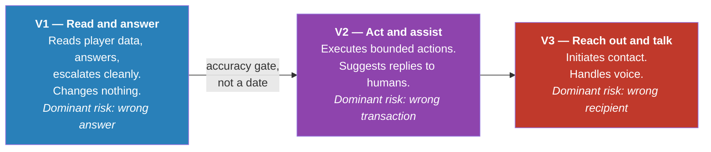

The dominant risk changes character at each boundary. That, more than the feature list, is what shapes the design.

---

# Part 2 — Context

## 2.1 The problem

Gambling operators handle very large support volumes — a mid-size operator runs 80,000–100,000 live chats a month across several markets and languages. The volume concentrates in a small number of repeated operational questions: where is my deposit, where is my withdrawal, why is my account not verified, where is my bonus, why can't I log in.

These are not information requests. They are questions about the state of a specific person's money, and they can only be answered by reading that person's account. A chatbot that recites the bonus terms is useless; the player wants to know how much further *they* have to wager.

Answering them requires three things a general-purpose assistant does not have: a live connection to the operator's back office, a way to be certain who the player is, and a set of rules about what may be said to whom.

## 2.2 What makes iGaming different

Five domain properties drive most of the design.

**It is licensed.** Operators hold gambling licences with conditions attached. Some conditions govern what may be said — wording that encourages further play is restricted or banned in several markets. Some govern what must happen — a self-exclusion request has statutory handling. A support agent that breaches these does not cause a bad review; it causes a regulatory event.

**Duty of care is a legal obligation, not a courtesy.** Operators must monitor for gambling harm and act on it. Any system in the conversation path inherits that obligation. Screening cannot be a feature that works most of the time.

**Distress hides inside ordinary questions.** A message about a missing deposit can carry a signal of gambling harm. Screening therefore cannot be attached to particular topics; it must run on everything.

**Frustration is the baseline.** Players contact support because money is missing. A large share of inbound is already annoyed. Any design that escalates on frustration escalates most of its volume — and often makes things worse, because for many questions an accurate answer in three seconds beats a twenty-minute queue.

**Mistakes are permanent.** Chat messages cannot be recalled. A wrong answer about a withdrawal is visible, quotable, and complainable.

## 2.3 The competitive landscape

The category is established and contested. Research on the current market:

| Vendor | Positioning |
|---|---|
| **Cevro AI** | The benchmark. "AI Procedures" — structured, human-readable workflows translating operator SOPs into machine-executable procedures, binding live data with compliance guardrails and deterministic logic. Claims 80–90% end-to-end resolution, CSAT 4.8/5, 40% workload reduction. Reports one operator live across three platforms in three weeks, 65% automation by end of month one, 82% by week six |
| **BetHarmony** (Symphony Solutions) | Multilingual iGaming agent for sportsbook and casino; claims 50–70% workload reduction with compliance and audit trails |
| **Lorikeet** | Claims end-to-end resolution of regulated player-service contacts — deposits, withdrawals, KYC, source of funds, bonus and bet disputes, RG escalations — across chat, email, voice, SMS, WhatsApp |
| **Ada** | Conversational AI for gaming with an explicit RG posture: detects distress and self-exclusion signals, escalates deterministically to trained humans |
| **Zendesk** | Horizontal help desk with an iGaming vertical |
| **Slotegrator, Avenga** | Adjacent — payment automation, KYC/AML, fraud and risk |

**What this tells us.** The declarative-procedure architecture is category-defining, not novel — the benchmark competitor markets exactly this. Deterministic RG escalation is an expectation, not a differentiator. Pre-built integrations are the stated onboarding accelerant, and months of custom API work is what buyers fear.

**Where we can actually differentiate** (§3.1 and §4.6 build these in):

1. **Provability, not assertion.** Being able to prove no conversation path discloses account data without an identity check — as a static property of the procedure, not a test result.
2. **Graduated emotional handling**, with distress separated from frustration, calibrated per market.
3. **Capability degradation as a feature.** "You get six of nine procedures, and here is exactly why" beats a failed integration.
4. **A real V2 safety envelope.** Idempotency, outcome verification, and dual control are where an action-taking agent in a money business lives or dies, and are conspicuously absent from competitor marketing.

**The uncomfortable part.** A read-only V1 concedes the category's headline claim — *"chatbots answer, agents act."* V1 must win on accuracy, compliance posture, and handover quality, and V2 must land.

## 2.4 Key constraints

| Constraint | Consequence |
|---|---|
| **Multi-tenant** | Every operator's data walled off from every other's; per-tenant configuration, credentials, and self-service setup. Substantially larger than a single-operator build |
| **V1 changes nothing** | Lower risk, faster to ship, but the automation ceiling is set by what can be answered without acting |
| **Channels not yet chosen** | Everything sits behind an adapter layer so the choice slots in later |
| **Operator systems vary widely** | We cannot assume any particular back office can answer any particular question |
| **Data residency** | Player conversation data may not be able to leave its jurisdiction |
| **Latency is user-visible** | A player is watching a chat window; the budget is seconds, not minutes |

## 2.5 Phase strategy

**V2 does not start on a date.** It starts when V1 has demonstrated: wrong-answer rate below 0.5% sustained, zero occurrences of generated text on a forbidden topic, zero occurrences of the agent talking over a human, and an audit trail that has survived a real compliance review.

Actions are the point where a wrong answer becomes a wrong transaction. The accuracy bar is the gate.

---

# Part 3 — High-level design

## 3.1 Design principles

### P1 — The procedure decides what happens; the model decides what it says

Support scenarios are written as **procedures**: declarative documents that name the steps, conditions, and constraints for handling one kind of question. The procedure decides which account data to read and in what order. The model does two narrower jobs — work out what the player is asking, and turn the facts the procedure fetched into a good sentence.

The model is never given the ability to fetch data. At composition time it receives a template and a fixed list of facts. "Decide to look up someone's balance" is not an action available to it.

**Why this matters:** identity-before-disclosure becomes a property you can prove by walking a finite graph, rather than a behaviour you sample-test. That proof is the artifact a regulator wants.

### P2 — Safety checks live outside the procedure engine

Screening for gambling harm, distress, abuse, and legally sensitive topics runs on every inbound message *before* a procedure is chosen, with authority to pre-empt everything downstream. A second check validates every outbound message before it reaches a player.

**Why this matters:** if screening were a step inside a procedure, any procedure that omitted it would silently drop coverage. Coverage must be 100%, and the only way that holds is if it cannot be skipped by omission.

### P3 — Connections to operator systems are capability contracts

Each kind of lookup is a declared **capability** — a specific question we can ask an operator's systems. At onboarding we probe which capabilities that operator supports. Procedures declare what they need; unmet capabilities disable the procedure for that tenant and route those contacts to humans.

**Why this matters:** we can build without knowing what any given back office can do, and a thin back office produces a smaller agent rather than a broken one.

### P4 — Fail toward humans, never toward silence or a guess

Every degraded path ends with a human holding the conversation and enough context to continue. No component is allowed to fail by inventing an answer, and none is allowed to fail by going quiet.

## 3.2 Architecture

Components are labelled by the phase that introduces them.

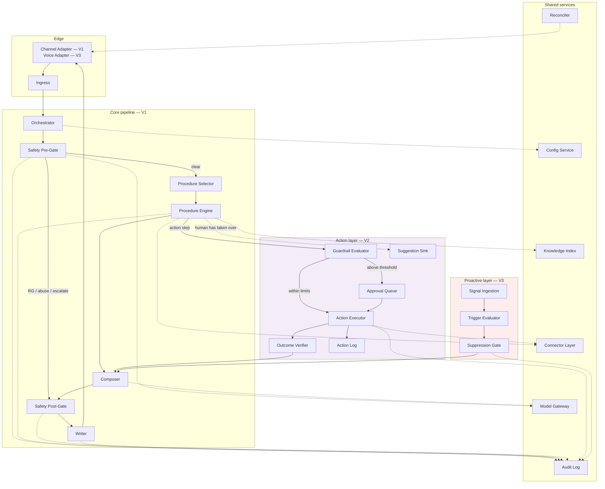

## 3.3 Request flow

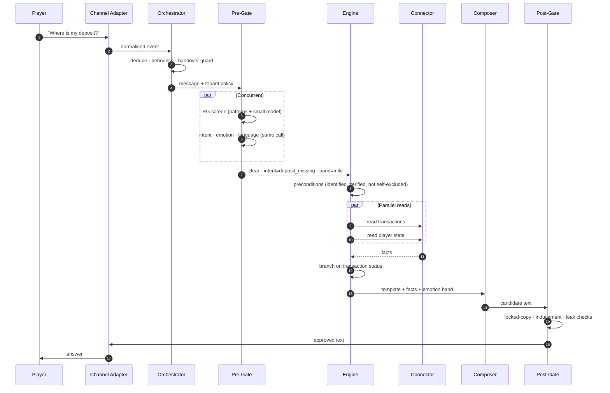

When the pre-gate fires, the engine never runs. That path is structural — there is no code route from pre-gate to composer that carries generated text.

## 3.4 Where models are used, and where they are deliberately not

| Uses a model | Uses no model |
|---|---|
| Understanding the message (intent, emotion, RG risk, abuse, confidence) | Procedure control flow and branching |
| Turning fetched facts into a sentence | Precondition evaluation |
| Verifying an answer is grounded in source content | Selecting approved fixed wording |
| Scanning outbound text for promotional language | Binding action parameters *(V2)* |
| Summarising context for a human | Evaluating ceilings and caps *(V2)* |
| Judging quality offline | Evaluating suppression and permission *(V3)* |

**The right-hand column is the more important one.** A model never decides that a refund should happen or how much it should be — the procedure does, from data the engine already fetched. A model never decides that a player may be contacted. Those are exactly the decisions where a probabilistic answer is indefensible.

## 3.5 Component map

| Component | Phase | One-line purpose |
|---|---|---|
| Channel Adapter | V1 | Translate between a channel and our canonical event format |
| Ingress | V1 | Accept, verify, persist, acknowledge fast |
| Orchestrator | V1 | Dedupe, debounce, load policy, enforce handover |
| Safety Pre-Gate | V1 | Screen every message; pre-empt when needed |
| Procedure Selector | V1 | Choose the procedure and version |
| Procedure Engine | V1 | Execute the procedure step by step |
| Connector Layer | V1 / V2 | Capability-contracted access to operator systems |
| Knowledge Index | V1 | Per-tenant search over operator content |
| Composer | V1 | Facts + template → player-facing text |
| Safety Post-Gate | V1 | Validate every outbound message |
| Writer | V1 | Send exactly once |
| Model Gateway | V1 | Single egress for all model calls |
| Config Service | V1 | Per-tenant policy and kill switches |
| Audit Log | V1 | Immutable record of every decision |
| Reconciler | V1 | Catch what the channel dropped |
| Guardrail Evaluator | V2 | Enforce authority, ceilings, caps |
| Approval Queue | V2 | Human sign-off above threshold |
| Action Executor | V2 | Execute actions exactly once |
| Outcome Verifier | V2 | Confirm the action actually happened |
| Action Log | V2 | Separate immutable financial record |
| Suggestion Sink | V2 | Route drafts to human agents |
| Signal Ingestion | V3 | Take behavioural signals from the operator |
| Trigger Evaluator | V3 | Decide which outreach plays match a player |
| Suppression Gate | V3 | Decide whether a player may be contacted at all |
| Voice Adapter | V3 | Speech in, speech out, same pipeline |

---

# Part 4 — Component details

Each component below states its purpose, the requirements it must satisfy, its design, its interface, and how it behaves when things go wrong.

---

## 4.1 Channel Adapter

**Purpose.** Translate between a specific chat channel and the one internal format the rest of the system understands.

**Requirements**

- Convert inbound messages from any channel into a single canonical event, and render outbound messages appropriately for each channel.
- Assume a sent message cannot be edited or deleted. Treat every send as final.
- Where a channel has no "typing…" indicator, emit an immediate acknowledgement so the player is not left watching nothing.
- Surface channel capabilities (buttons, attachments, formatting) so the composer can use them where present and degrade gracefully where absent.

**Design.** One adapter per channel, all implementing the same two-way interface. Inbound produces a `ConversationEvent`; outbound accepts an approved message and channel hints. Everything channel-specific stops here — no other component knows which channel a conversation is on, except the voice adapter's latency flag (§4.25).

**Interface**

```
inbound(raw_channel_payload) -> ConversationEvent
outbound(approved_message, channel_hints) -> DeliveryReceipt
capabilities() -> {buttons, attachments, typing_indicator, max_length}
```

**Failure behaviour.** A malformed inbound payload is persisted raw and dropped from processing with an alert — never guessed at. A failed outbound send returns to the Writer for its retry logic; the adapter itself never retries, so the send-exactly-once guarantee has one owner.

---

## 4.2 Ingress

**Purpose.** Accept inbound events fast enough that the channel does not time out, and never lose one.

**Requirements**

- Verify the event is authentic before accepting it.
- Acknowledge quickly and process asynchronously — inference takes longer than most channels will wait.
- Persist the raw event before doing anything else.
- Never lose a player message, including during a partial outage.

**Design.** Verify signature, write the raw payload to durable storage, enqueue, return an acknowledgement. Nothing else. The acknowledgement path does no lookups, no model calls, and no policy evaluation, so its latency is bounded by a single write.

**Interface**

```
accept(signed_payload) -> Ack        target: under 100 ms
```

**Failure behaviour.** If persistence fails, the ingress does *not* acknowledge — better that the channel retries than that we silently drop a message. Downstream failures never surface as a non-acknowledgement, because a channel that sees repeated failures will disable the integration.

---

## 4.3 Orchestrator

**Purpose.** Decide whether this message should be processed at all, and assemble the context needed to process it.

**Requirements**

- Never process the same message twice.
- Wait briefly for players who send three short messages instead of one long one, then answer once.
- **Once a human replies, stop permanently.** Only an explicit human hand-back returns the conversation to the agent.
- Cap how many times the agent replies in one conversation; at the cap, hand over rather than continue.
- Track conversation state: status, last message handled, replies sent, topic, confidence, emotional trend, reason for handover.

**Design.** A short state machine per conversation plus a debounce window of 2–4 seconds. Handover is a **one-way transition** — the state machine has no automatic path out of `handed_over`, so the "never talk over a human" guarantee is structural rather than a check that could be missed.

```
active ──human replies──▶ handed_over ──explicit hand-back──▶ active
  │                                                              
  ├──kill switch / RG policy──▶ suppressed
  └──closed──▶ closed
```

Loads tenant policy from the Config Service and attaches it to the event, so no downstream component reads configuration independently and they cannot disagree about it.

**Interface**

```
process(ConversationEvent) -> EnrichedEvent | Dropped(reason)
```

**Failure behaviour.** If conversation state cannot be loaded, the message escalates. Processing without knowing whether a human is already handling the conversation is not an acceptable degraded mode.

---

## 4.4 Safety Pre-Gate

**Purpose.** Screen every inbound message and, where necessary, stop everything downstream before it runs.

**Requirements**

- **Screen 100% of inbound messages** for distress and problem-gambling signals, regardless of what the message is about.
- Screening must be part of the pipeline, not a procedure step, so no procedure can skip it by omission.
- On any gambling-harm signal: send operator-approved wording for that market and escalate immediately to a trained human. **No generated text.**
- Maintain a per-tenant always-escalate topic list, defaulting to: responsible gambling and self-exclusion, account closure, complaints and disputes, AML and source of funds, chargebacks, legal threats, safeguarding, and anything involving money being paid back. **Not one generated word reaches the player on these topics.**
- Assess emotional state on every message before acting.
- Escalate rather than answer when confidence is below the tenant's threshold.
- Escalate immediately when a player asks for a human, with no deflection attempt.
- Complete in under 400 ms.

**Design — order of authority.** Evaluated in this order, and the order is load-bearing.

| Priority | Check | On trigger | Cost |
|---|---|---|---|
| 1 | Kill switch (tenant or global) | Escalate; keep ingesting and logging | free |
| 2 | Conversation closed, handed over, or suppressed | Decline | free |
| 3 | Player self-excluded or in cooling-off | Distinct protective policy | 1 lookup |
| 4 | **Gambling-harm or distress signal** | Approved wording + trained human. **Pre-empts everything below** | shared model call |
| 5 | Abuse or threat | Distinct policy, flagged | shared model call |
| 6 | Always-escalate topic | Approved acknowledgement + escalate | shared model call |
| 7 | Explicit request for a human | Immediate escalation | free |
| 8 | Reply ceiling reached | Escalate | free |
| 9 | Emotional band | Modulate behaviour (below) | shared model call |
| 10 | Confidence below threshold | Escalate | free |

**Why RG outranks emotion.** A distressed player frequently reads as frustrated. Routing them to the ordinary support queue instead of the RG path is the failure that costs a licence, so gambling-harm detection pre-empts emotional routing unconditionally.

**Design — two-layer screening.** A deterministic multilingual pattern layer runs alongside the model classification, and the results are **OR-ed, never AND-ed**. Either layer firing is sufficient. This is what makes 100% coverage robust to a model regression or an outage.

**Design — emotional bands.** Five bands, not a binary switch, because in this domain mild frustration is the norm and a binary rule would escalate most of the volume.

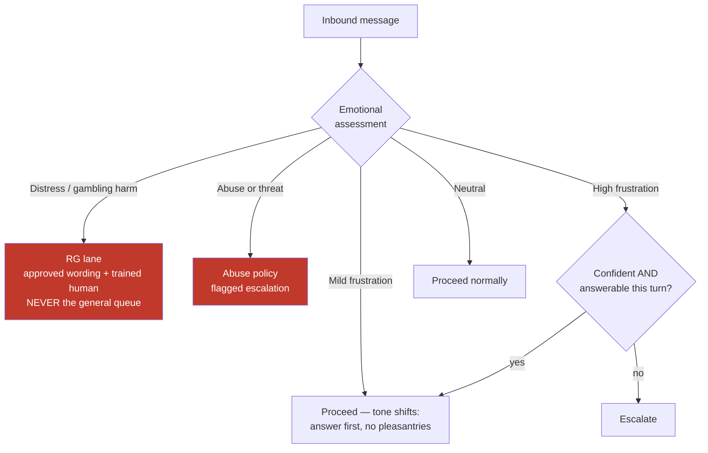

Two signals matter more than the absolute reading:

- **Trajectory.** Whether someone is getting *more* upset across turns predicts "a human should take this" better than any single measurement. A calm third contact about the same unresolved deposit outranks one angry first contact.
- **Availability.** Escalating at 3am when nobody is on shift produces silence — the exact failure we design against. The router reads staffing state and, where no human is available, attempts the answer with honest disclosure of the wait.

The band also reaches the Composer. Detecting frustration and then replying cheerfully is worse than not detecting it.

**Calibration.** Emotion detection degrades badly outside English, and ordinary directness in German or Dutch reads as anger to a model trained on English politeness norms. Thresholds are configured per tenant **and per market**, with per-language accuracy monitored and alerted on.

**Interface**

```
screen(EnrichedEvent) -> Clear(classification) | Preempt(reason, locked_copy_key, escalation_target)
```

**Failure behaviour.** If the model call fails, the deterministic layer still runs and the conversation escalates. **The gate never passes a message through unclassified.**

---

## 4.5 Procedure Selector

**Purpose.** Choose which procedure handles this message, at which version.

**Requirements**

- Map the classified topic to a procedure, honouring the tenant's own procedures over the shared baseline.
- Where a player asks two things at once, handle each properly rather than answering one and dropping the other.
- Where a procedure requires a capability the tenant's systems cannot supply, do not select it — route to a human instead.

**Design.** Primary topic selects the procedure. A **secondary topic is carried into the response step** so the answer can acknowledge it, and is logged. If the secondary topic is on the always-escalate list, it wins over the primary.

Procedure runs are scoped to **one question, not one conversation**. A conversation holds a stack of short-lived runs. This costs more state and handles how people actually write.

Version is pinned at selection time, so a procedure edit mid-conversation does not change behaviour halfway through.

**Interface**

```
select(classification, tenant_policy) -> ProcedureRun(name, version) | NoProcedure(reason)
```

**Failure behaviour.** No matching procedure routes to the general-information path (§4.8) if the question does not touch the account, and to a human if it does.

---

## 4.6 Procedure Engine

**Purpose.** Execute a procedure step by step, deterministically, recording everything.

**Requirements**

- Procedures are documents, not code — writable and reviewable by CS leads and compliance officers, versioned, and comparable side by side.
- Each procedure states: its triggers, its preconditions, its ordered steps, its forbidden actions, its escalation rules, what must be disclosed to the player, what player data it may touch, and which operator capabilities it needs.
- If a precondition fails, route to a defined fallback. **Never proceed on a guess.**
- The full step vocabulary — including action steps — exists from the first release, with execution controlled by settings.
- A procedure using a disabled step type fails when it is written, with a clear message, never at runtime in front of a player.
- Record every step: inputs, outputs, duration, decision, and the procedure version in force.
- Support a rehearsal mode that runs against real conversations and records what would have been said, without sending.
- Tenants can write new procedures without our engineers.

**Design — format.** Declarative YAML. The document names steps and constraints; it contains no retries, error handling, logging, authentication, or rate limiting. The engine supplies all of that uniformly for every procedure — which is exactly what makes a non-engineer able to write one.

```yaml
procedure: where_is_my_deposit
version: 7
owner: payments-cs
status: active

triggers:
  intents: [deposit_missing, deposit_delayed]
  confidence_min: 0.85

requires_capabilities: [PlayerState, Transactions]

preconditions:
  - player.identified
  - player.identity_verified
  - not player.self_excluded
  on_fail: escalate(reason: precondition_failed)

forbidden:
  - generate_text_about: [refund_promise, timing_guarantee]
  - steps: [trigger_refund]

steps:
  - id: fetch
    action: read_transactions
    params: {type: deposit, window: 7d}
    on_error: escalate(team: payments, reason: backoffice_unavailable)

  - id: balance
    action: read_player_state
    params: {fields: [balance, currency]}

  - id: route
    action: branch
    on: fetch.latest.status
    cases:
      completed: explain_completed
      pending:   explain_pending
      failed:    escalate_failed
      not_found: escalate_missing

  - id: explain_completed
    action: respond
    template: deposit_completed
    facts: [fetch.latest.amount, fetch.latest.completed_at, balance.amount]

escalation:
  default_team: payments
  include_context: [transcript, facts_read, conclusion, confidence, emotion_trajectory]

disclosure:
  - automated_agent

data_classification:
  reads: [transaction_history, balance]
  never_reads: [payment_instrument_full, source_of_funds_docs]
```

**Design — step vocabulary.**

| Group | Steps | Enabled |
|---|---|---|
| Identity | `verify_identity` | V1 |
| Read | `read_player_state`, `read_transactions`, `read_kyc_status`, `read_bonus_state`, `read_limits`, `read_knowledge` | V1 |
| Control | `classify`, `branch`, `wait`, `respond`, `escalate`, `log` | V1 |
| Action | `issue_bonus`, `trigger_refund`, `resend_verification`, `update_ticket`, `apply_limit`, `reset_credential`, `close_account` | Defined V1, executable V2 |

**Design — author-time validation.** Because a procedure is declarative, these are provable before anything runs:

| Check | Kind |
|---|---|
| Every branch case has a destination | Graph completeness |
| Every referenced capability is declared and available for this tenant | Contract |
| No forbidden step appears in the step list | Set membership |
| Every response template has approved wording in every language the tenant supports | Coverage |
| **No path reaches a response step disclosing account data without passing `verify_identity` first** | **Reachability** |
| *(V2)* Every action step declares a compensating action or requires approval | Completeness |
| *(V2)* Every action step's ceiling is within the tenant's authority grant | Bounds |

The reachability check is the load-bearing one, and the strongest thing this design does. The procedure is a finite graph, so you can walk **every** path — not a sample — and prove the identity check is unbypassable. If one path skips it, the procedure fails validation and cannot be published.

This is a category difference from prompting, not a degree difference. Testing samples behaviour; this checks structure, and structure is finite.

**What the check does *not* prove:** that the identity check is strong enough (a policy question per jurisdiction), that the fetched data is correct (the operator's system), or that the sentence is accurate (grounding and the post-gate). It proves ordering and gating — the guarantee hardest to obtain any other way, and the one regulators ask about most directly.

**Design — execution model.**

```mermaid
stateDiagram-v2
    [*] --> Selected
    Selected --> CapabilityCheck
    CapabilityCheck --> Disabled: capability missing
    CapabilityCheck --> Preconditions: available
    Preconditions --> Fallback: any fails
    Preconditions --> Executing: all hold
    Executing --> Executing: next step
    Executing --> Composing: response step
    Executing --> ActionPath: action step (V2)
    Executing --> Escalated: escalate step
    Executing --> Fallback: step error
    ActionPath --> Composing: verified
    ActionPath --> Frozen: verification failed
    Composing --> PostGate --> Sent
    Disabled --> Escalated
    Fallback --> Escalated
    Frozen --> Escalated
    Sent --> [*]
    Escalated --> [*]
```

**Interface**

```
execute(ProcedureRun, EnrichedEvent) -> Facts + Template | Escalate(context) | Frozen(context)
dry_run(ProcedureRun, HistoricalConversation) -> WouldHaveSaid
```

**Failure behaviour.** Any step error routes to the procedure's declared escalation. A step that returns something unexpected freezes the run and escalates with the raw values attached — the engine never coerces an unexpected value into an expected one.

**Design tension to manage.** Too rigid and coverage collapses; too expressive and the format quietly becomes a programming language, at which point only engineers can write procedures and the entire premise is gone. The second is the likelier failure, because every individual request to make it more powerful sounds reasonable. Rule of thumb: if a procedure needs something the format cannot express, that usually means **two procedures plus an escalation**, not a richer format.

**Multi-tenant caveat.** Tenants may override baseline procedures. If every tenant forks every procedure, the library is 30 × N documents rather than 30. Keep the baseline canonical, make overrides narrow and comparable against it, and treat a tenant who has forked everything as an onboarding failure rather than a supported configuration.

---

## 4.7 Connector Layer

**Purpose.** Give the engine one uniform, contract-checked way to reach any operator's systems.

**Requirements**

- Identify the player using the operator's own stable customer identifier. Email matching alone is not sufficient.
- Confirm identity before revealing anything about an account, to a standard set per jurisdiction.
- Detect self-excluded and cooling-off players at identity resolution and route them to a distinct protective policy.
- **If operator systems are unavailable, escalate with an honest explanation. Never guess, never invent a status.**
- Limit how hard we query each operator's systems — we must not be why an operator's back office falls over.
- Mask personal data before anything reaches a model provider.

**Design — capability contracts.** Each type of lookup is a declared capability with a fixed interface. A tenant's connector implements what that operator can actually supply; nothing more is required to onboard.


| Contract | Read (V1) | Write (V2) |
|---|---|---|
| `IdentityProvider` | `resolve`, `verify` | — |
| `PlayerStateProvider` | `get_state`, `get_limits`, `get_rg_status` | `apply_limit`, `unlock_account` |
| `TransactionProvider` | `list_deposits`, `list_withdrawals`, `get_status` | `trigger_refund` |
| `KycProvider` | `get_status`, `get_outstanding_documents` | `resend_verification`, `request_reupload` |
| `BonusProvider` | `get_active`, `get_wagering_progress`, `check_eligibility` | `issue_bonus` |
| `TicketProvider` | — | `write_outcome`, `update_ticket` |
| `CredentialProvider` | — | `reset_credential` |

**Design — data minimisation.** The procedure declares which data classes it may touch. The connector redacts everything else from results **before** they enter a prompt. This is the concrete mechanism behind PII masking: it happens at the boundary, so the model never receives fields the procedure did not declare.

**Design — read and write are granted separately.** A tenant may support transaction reads without granting refunds. V2 re-runs capability negotiation for the write surface only, against a separate credential.

**Interface**

```
capability(name).method(params) -> Result | Unavailable | Unsupported
probe(tenant) -> {capability: supported | unsupported}
```

**Failure behaviour.** `Unavailable` escalates with a truthful explanation to the player. `Unsupported` should never occur at runtime, because procedures requiring it were disabled at selection — if it does, it is a configuration bug and the run freezes.

---

## 4.8 Knowledge Index

**Purpose.** Answer questions that do not touch the account, from the operator's own published content.

**Requirements**

- Keep a searchable copy of each operator's content: terms and conditions, bonus terms, help centre, payment methods, game rules.
- Answers must be grounded in that content. The agent must not state terms or policy it cannot point to a source for.
- Re-index on change, and show the operator when content has gone stale.
- Maintain a per-market library of approved fixed wording, separate from the searchable content.

**Design.** Per-tenant partition, retrieval filtered by the player's market so the answer cites the copy that actually applies to them. A grounding check runs before composition; if the retrieved content does not support an answer, the conversation escalates rather than the model filling the gap.

**Approved fixed wording lives in a separate store** from the searchable index — version-controlled, human-translated per market, and hash-verifiable so the post-gate can confirm that what was sent is exactly what was approved.

The general-information procedure is the only path reaching retrieval without an account lookup. It is effectively a constrained, grounded generation loop for the long tail: **procedures for the common questions, grounded retrieval for the tail, humans for everything else.**

**Interface**

```
search(query, market, language, tenant) -> [Passage]
approved_copy(key, market, language, tenant) -> LockedText + hash
```

**Failure behaviour.** No usable passage escalates. Stale content beyond a configured threshold raises a tenant-visible warning — quoting last month's bonus terms is a complaint generator.

---

## 4.9 Composer

**Purpose.** Turn the facts a procedure fetched into a sentence a player wants to read.

**Requirements**

- Reply in the player's language, across 120+ languages.
- Approved fixed wording is human-translated per market and never machine-translated at runtime.
- The emotional band shapes tone, not just routing.
- Say the agent is automated in the first message of every conversation, under a name that is clearly not a person's.
- Never write anything promotional or that encourages further play.

**Design.** The composer receives a template, a fixed list of facts, and the emotional band. It does **not** receive tools, and it does not receive the player's raw message as an instruction — only as context. It cannot fetch anything, so a manipulation attempt in the message body can influence phrasing at most, which is what the post-gate exists to catch.

Facts arrive as named values (`amount = €200.00`, `completed_at = 2 August 14:20`), so the model cannot invent a date — the date is either present or the template branch that needs it was not selected.

Tone mapping by band: neutral gets the normal voice; mild frustration gets answer-first with pleasantries dropped; high frustration reaching composition at all means the answer is confident and complete, phrased directly.

**Interface**

```
compose(template, facts, band, language, tenant_tone) -> CandidateText
```

**Failure behaviour.** A template referencing a fact the procedure did not supply is a validation error caught at author time, not a runtime substitution. If composition fails, escalate.

---

## 4.10 Safety Post-Gate

**Purpose.** The last thing between generated text and a player.

**Requirements**

- Confirm approved fixed wording verifiably came from the approved store.
- Confirm no promotional or play-encouraging language is present.
- Confirm no other player's details are present.
- Sanitise output before sending.
- Treat everything a player writes, and everything retrieved, as untrusted — it must never alter agent instructions or take over a procedure.

**Design.** Mostly deterministic, which is what makes it cheap enough to run on everything.

| Check | Method |
|---|---|
| Locked wording matches the approved store | Hash comparison |
| No unresolved template placeholders | Pattern match |
| No other player's identifiers present | Scan against the resolved player's identifiers |
| No promotional or inducement language | Deterministic list plus a small-model classifier |
| Output sanitised | Deterministic |

This is belt and braces on the one failure class that cannot be undone. It is also how "zero generated text on a forbidden topic" holds as a claim rather than a hope: when the pre-gate has selected locked wording, the post-gate verifies the hash, so a generated sentence cannot reach a player on those topics even if something upstream misbehaved.

**Interface**

```
validate(CandidateText, context) -> Approved(text) | Rejected(reason)
```

**Failure behaviour.** Rejection escalates and raises a high-severity alert. A rejection means an upstream component produced something it should not have, which is an incident regardless of the fact that we caught it.

---

## 4.11 Writer

**Purpose.** Send exactly once.

**Requirements**

- Never send the same reply twice. A duplicate message to a player is worse than a slow one.
- Stop immediately when the kill switch is on, while continuing to ingest, classify, and log.

**Design.** Idempotency key derived deterministically from the triggering inbound message and the procedure run. Claimed before sending. The Writer is the only component permitted to call a channel adapter's outbound path, so send-exactly-once has exactly one owner and one place to audit.

Re-checks the kill switch immediately before sending — the switch must take effect in under 10 seconds, and a message already composed must not slip out behind it.

**Interface**

```
send(Approved, conversation, idempotency_key) -> Sent | AlreadySent | Suppressed
```

**Failure behaviour.** Send failure retries with backoff against the same key. Repeated failure escalates the conversation, so a channel outage becomes a human handover rather than a silent gap.

---

## 4.12 Model Gateway

**Purpose.** The single egress for every model call, so routing, caching, cost, and fallback have one owner.

**Requirements**

- Route each call to the appropriate model tier.
- Keep per-call cost and latency within the system's budgets.
- Record which model produced every output, for audit.
- Never let a model failure become a wrong answer.

**Design — routing table.** The rule: **a small model touches every message; a mid model runs only when a procedure reaches a response step; action execution uses no model at all.**

| # | Use case | Phase | Volume | Model | Price (in/out per Mtok) | Why this tier |
|---|---|---|---|---|---|---|
| 1 | Language detection | V1 | Every message | fastText / CLD3 (non-LLM) | free | Deterministic, microseconds |
| 2 | RG pattern screen | V1 | Every message | Deterministic patterns | free | Recall floor independent of any model being up |
| 3 | **Unified classification** — intent, emotion, RG risk, abuse, confidence, entities | V1 | **Every message** | **Claude Haiku 4.5** (`claude-haiku-4-5`) | $1 / $5 | Highest-volume call in the system; structured extraction against a fixed taxonomy. **This is where the small model earns its keep** |
| 4 | RG secondary confirmation | V1 | ~5% | Claude Sonnet 5 (`claude-sonnet-5`) | $3 / $15 | Precision pass; recall already guaranteed by #2 ∪ #3 |
| 5 | **Player-facing composition** | V1 | 1–2 per conv | **Claude Sonnet 5** | $3 / $15 | Where satisfaction is won — empathy and accuracy over a fixed fact set |
| 6 | Complex composition (multi-topic, low confidence, high emotion) | V1 | ~5% | Claude Opus 5 (`claude-opus-5`) | $5 / $25 | The hardest turns, most likely to otherwise escalate |
| 7 | Grounding verification | V1 | Per knowledge answer | Claude Haiku 4.5 | $1 / $5 | Binary check against retrieved source |
| 8 | Post-gate language scan | V1 | Every outbound | Claude Haiku 4.5 | $1 / $5 | Runs beside the deterministic checks |
| 9 | Escalation context pack | V1 | Per escalation | Claude Haiku 4.5 | $1 / $5 | Human-facing, never player-facing |
| 10 | Quality sampling, rehearsal judging | V1 | Offline | Claude Opus 5 via Batch API | −50% | Quality matters, latency does not |
| 11 | Procedure authoring assistance | V1 | On demand | Claude Opus 5 | $5 / $25 | Helping a CS lead draft a procedure |
| 12 | **Action parameter binding** | V2 | Per action | **none — deterministic** | — | Values come from the procedure and already-fetched facts |
| 13 | Action confirmation message | V2 | Per action | Claude Sonnet 5 | $3 / $15 | The action already happened; this phrases the outcome |
| 14 | Approval summary for the reviewer | V2 | Per approval | Claude Haiku 4.5 | $1 / $5 | Internal, structured |
| 15 | Agent-assist suggestion | V2 | Per human turn | Claude Sonnet 5 | $3 / $15 | A human reads and edits it; quality matters, stakes are lower |
| 16 | **Suppression and permission evaluation** | V3 | Per candidate | **none — deterministic** | — | Database lookups. Inferring these would be indefensible |
| 17 | Proactive personalisation | V3 | Per send | Claude Sonnet 5 | $3 / $15 | Same composer, different template source |
| 18 | Voice classification | V3 | Every utterance | Claude Haiku 4.5 | $1 / $5 | Same call as #3 on a tighter budget |
| 19 | Prosody emotion features | V3 | Every utterance | Audio feature extraction (non-LLM) | — | Tone of voice carries what a transcript cannot |

**Design — why the split pays.** Roughly 40% of V1 conversations escalate without ever reaching a response step. Those pay for classification and a context pack — small model only — and never touch a generation-tier model. Classification is three calls per conversation but **15% of model cost**; composition is two calls and **71%**.

Published routing practice puts the saving from a small-classifier front end at 40–70% with no measurable quality drop on most requests. Our variant adds that the procedure engine between classification and composition is deterministic, so much of the middle costs nothing at all.

**Design — one classification call, not three.** Separate calls for intent, emotion, and RG would triple the highest-volume cost and add two round trips to a sub-3-second budget. One call returns one structured object:

```json
{
  "intent":     { "primary": "deposit_missing", "secondary": "bonus_eligibility" },
  "confidence": 0.93,
  "emotion":    { "band": "mild_frustration", "trajectory": "rising", "score": 0.62 },
  "rg_risk":    { "level": "none", "signals": [] },
  "abuse":      { "level": "none" },
  "language":   "de",
  "entities":   { "amount": "200 EUR", "method": "Visa", "when": "yesterday" }
}
```

Shape guaranteed by structured outputs rather than parsed hopefully. Extended thinking is off for this call — it is extraction against a fixed taxonomy on a 400 ms budget.

**Design — caching, and a constraint that shapes the prompt.** The classification system prompt is stable per tenant and cached, as is the composition prefix. But the minimum cacheable prefix is model-dependent and **not monotonic across tiers**:

| Model | Minimum cacheable prefix |
|---|---|
| Claude Opus 5 | 512 tokens |
| Claude Sonnet 5 | 1,024 tokens |
| **Claude Haiku 4.5** | **4,096 tokens** |

Haiku has the *highest* minimum. A compact 2,000-token classification prompt would **silently fail to cache** — no error, just full price on the highest-volume call in the system.

So the classification prompt is deliberately built to exceed 4,096 tokens: full taxonomy, per-band examples, per-market calibration notes, RG signal vocabulary. One of the rare cases where a longer prompt is cheaper, because cache reads cost roughly 10% of input. Cache hit rate is monitored and alerted on, because a silent cache break is a ~36% cost increase with no functional symptom.

Cache hygiene: no timestamps or request IDs in the prefix; deterministic key ordering; player-specific context after the last cache breakpoint; never change model mid-conversation.

**Interface**

```
call(purpose, prompt_parts, schema?) -> Response + {model, cache_state, tokens, latency}
```

**Failure behaviour**

| Failure | Behaviour |
|---|---|
| Classification model unavailable | Deterministic layer still runs; conversation escalates. Never proceeds unclassified |
| Composition model unavailable | Escalate. **Never silently fall back to a lower tier for player-facing text** |
| Latency ceiling breached | Escalate with whatever context was gathered |

---

## 4.13 Config Service

**Purpose.** Hold every per-tenant setting, and make the kill switches instant.

**Requirements**

- Configurable per tenant: confidence thresholds, emotion thresholds, always-escalate topics, reply cap, debounce window, latency ceiling, disclosure wording, RG wording, supported languages, market mapping, business hours, escalation destinations, action authority, and kill switches.
- Kill switches — one per tenant and one global — that immediately stop everything said to players while ingestion, classification, and logging continue.
- A separate switch that stops actions only, without silencing the agent *(V2)*.
- Kill switch effective in under 10 seconds.

**Design.** Read once per conversation turn by the Orchestrator and attached to the event, so no downstream component reads configuration independently and they cannot disagree. Kill switches are the exception — re-read at the Writer and Action Executor immediately before the irreversible act.

**Why the action switch is separate.** Flipping it degrades the agent to V1 behaviour: still answering, no longer acting. That is a far more useful incident response than silencing it, because silence means every conversation queues for a human.

**Interface**

```
policy(tenant) -> TenantPolicy
kill_switch(tenant) -> {conversational: bool, actions: bool}
```

**Failure behaviour.** If policy cannot be loaded, the conversation escalates. Running on stale or default policy in a regulated setting is not an acceptable degraded mode.

---

## 4.14 Audit Log

**Purpose.** Make every interaction reconstructable.

**Requirements**

- Any interaction can be reconstructed end to end: what was read, what was decided, what was said, under which procedure version and which settings.
- Records cannot be altered, and tampering is detectable.
- Records are exportable in a form an operator can hand to a regulator.
- Retention is configurable per tenant and per market.
- Support erasure requests across conversations and records.

**Design.** Append-only. One record per step execution:

```
tenant · conversation · run · step
procedure name · procedure version · policy version
inputs (post-redaction) · outputs (post-redaction)
model in force · cache state · token usage
duration · decision · gate outcomes
timestamp
```

Together with the procedure documents and their sign-off history, this is what answers a regulator's question. *"Show me no player was told their balance without an identity check in Q3"* is answerable with three artifacts: the procedure versions in force, the validation result proving the check is unbypassable, and the log showing which version ran for each conversation.

**Interface**

```
record(StepExecution) -> void
reconstruct(conversation) -> [StepExecution]
export(tenant, period, format) -> RegulatorPackage
```

---

## 4.15 Reconciler

**Purpose.** Catch what the channel dropped.

**Requirements**

- Do not assume messages always arrive. Check periodically against the source and pick up anything missed.
- Treat an inbound notification as "something happened, go look" rather than trusting its contents — messages do not arrive in order.

**Design.** A periodic sweep listing recently updated conversations from each channel and comparing against what we processed. Anything missing is enqueued as if newly received, through the same pipeline, with the same idempotency guarantees.

**Interface**

```
sweep(tenant, since) -> [MissedEvent]
```

---

## 4.16 Guardrail Evaluator *(V2)*

**Purpose.** Decide whether a proposed action is allowed, and at what value.

**Requirements**

- Action authority is configurable per tenant and per procedure, with monetary ceilings and rate caps.
- Above a set value, a human approves before anything happens.

**Design — layered authority.**

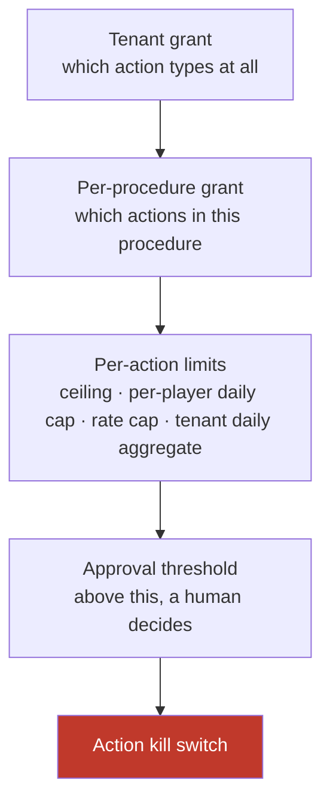

**Exceeding a limit routes to approval — never a silent failure, and never a truncated action.** An agent that quietly issues €50 when the procedure said €200 is worse than one that asks.

**Interface**

```
evaluate(action, params, tenant, procedure) -> Allow | RequireApproval(reason) | Deny(reason)
```

**Failure behaviour.** If authority cannot be resolved, deny. The default is always "do not act."

---

## 4.17 Approval Queue *(V2)*

**Purpose.** Put a human in the loop above a threshold, without the player noticing a seam.

**Requirements**

- Actions above a configured value execute as proposals: the agent prepares it, a human approves, the agent completes it and confirms.
- Irreversible actions always require approval.

**Design.** The proposal carries a small-model summary for the reviewer: player, requested action, value, the facts the procedure fetched, and why the procedure reached this step. Reviewer decisions are recorded in the action log with approver identity and timestamp.

**From the player's side it is one conversation** — "let me sort that out for you," then a confirmation. They never see the approval step.

**Interface**

```
propose(action, params, summary) -> ApprovalRequest
resolve(request, approver, decision) -> Approved | Rejected
```

**Failure behaviour.** Timeout without a decision escalates the conversation to a human with the pending action attached. An action never executes because nobody looked at it.

---

## 4.18 Action Executor *(V2)*

**Purpose.** Execute an action against operator systems exactly once, or know that it did not.

**Requirements**

- Every action is checked beforehand and safe to retry. A retry must never issue a bonus twice or refund twice.
- Actions are recorded in their own separate, unalterable log.

**Design — lifecycle.**

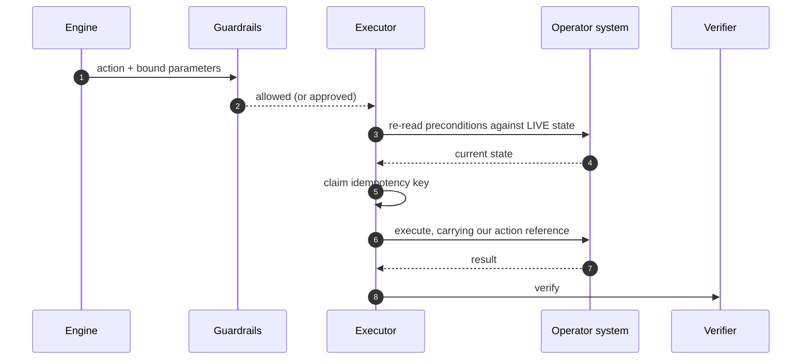

**Design — preconditions re-verified at execution time.** A procedure's preconditions are re-checked immediately before the write, not at selection time. State moves during a conversation: a bonus eligible when the procedure started may not be eligible eight seconds later after the player placed a bet. The check that matters is the last one.

**Design — idempotency.** Retries exist at the channel, at our writer, and at the operator's API. A timeout tells you nothing about whether the action landed.

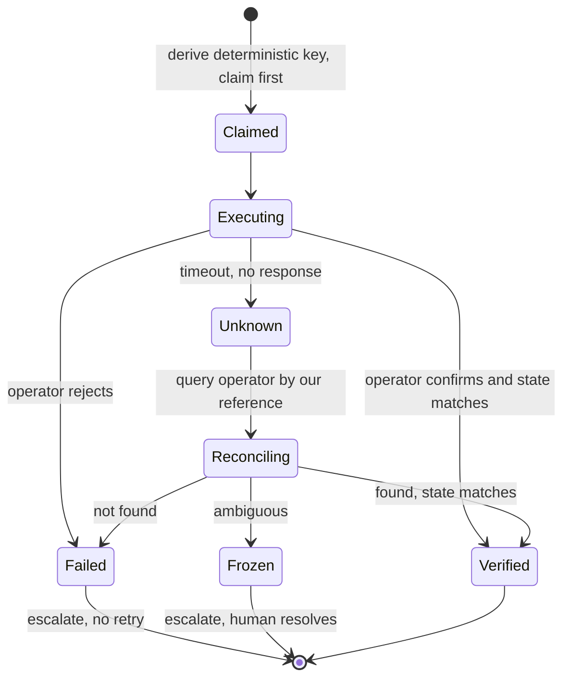

Rules:

- The key is **deterministic**, derived from tenant, conversation, triggering message, and step. The same conversational moment always produces the same key.
- **Claim before executing.** An already-claimed key means resolve the existing claim, not execute again.
- **On timeout, never blind-retry.** Reconcile by querying the operator for our reference, and act only on what you find.
- **Ambiguous outcome freezes and escalates.** A duplicate refund is materially worse than a delayed one and, unlike a duplicate message, cannot be apologised away.

**A hard consequence for onboarding:** every action carries our reference so reconciliation is possible. **An operator system that cannot accept an external reference cannot be granted write capabilities.** This is a capability-negotiation criterion, not an implementation detail to work around.

**Design — reversibility.** Every action step declares one of two things at author time, and validation enforces it:

```yaml
- id: issue_goodwill_bonus
  action: issue_bonus
  params: {amount: 10, currency: EUR}
  compensating_action: revoke_bonus     # reversible
  ceiling: 25

- id: close_account
  action: close_account
  requires_approval: always             # not reversible, so always human
```

There is no third option. An action that is neither reversible nor approval-gated fails validation.

**Interface**

```
execute(action, params, idempotency_key) -> Executed(ref) | Failed(reason) | Frozen(context)
```

---

## 4.19 Outcome Verifier *(V2)*

**Purpose.** Confirm the action actually did what it was supposed to.

**Requirements**

- After every action, re-read the affected state and confirm the expected transition. A mismatch freezes the procedure run and escalates with context.

**Design.** Reads the same state the action was meant to change and compares before and after. Three outcomes: confirmed, mismatch, or unknown. Only confirmed proceeds to composition.

**Why this exists.** Without verification, an action that silently does nothing looks exactly like one that succeeded — and the player gets a confident confirmation of something that never happened. This is what makes "zero incorrect actions" a testable claim rather than an aspiration.

**Interface**

```
verify(action, state_before, expected_transition) -> Confirmed(state_after) | Mismatch | Unknown
```

**Failure behaviour.** Mismatch and unknown both freeze the run and escalate with before/after states attached. Neither retries.

---

## 4.20 Action Log *(V2)*

**Purpose.** A separate, immutable record of every action taken.

**Requirements**

- Actions are recorded separately from conversations, immutably.

**Design**

```
action_id                 the deterministic idempotency key
tenant · conversation · run · step
action_type
parameters                exact values sent
authority_snapshot        ceilings and caps in force at execution
approval                  {required, approver, approved_at} | null
precondition_recheck      state read immediately before execution
state_before / state_after
verification_result       confirmed | mismatch | unknown
compensating_action_id    if reversed
executed_at · operator_reference
```

**Why separate from the audit log.** An action is a financial event with a different retention, access, and export profile from a conversation. A regulator asking about transactions should not have to read chat transcripts to find them, and a conversation-retention policy must never delete a financial record.

---

## 4.21 Suggestion Sink *(V2)*

**Purpose.** Give human agents the agent's draft without any risk of it reaching a player.

**Requirements**

- Produce suggestions that only human agents see, never players.
- Measure how often agents accept a suggestion and how much they change it.

**Design.** Almost free, because it reuses the entire pipeline. When a conversation is handed over, procedures continue running **in shadow** — same classification, same selection, same reads, same composition — but the output routes here instead of to the Writer.

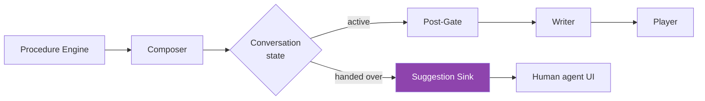

One branch at the terminal. No new engine, no new procedures, no new safety model.

**What relaxes and what does not.** The full post-gate is not needed, because a human reads and edits before anything is sent. But **cross-tenant and personal-data checks still apply** — a suggestion showing another operator's player data is exactly as fatal as a message doing so.

**Why it matters strategically.** It converts escalations into assisted resolutions, and gives the human team reason to trust the agent before it is allowed to act. Accept rate and edit distance are also the cleanest available proxy for answer quality, because a human grades every suggestion.

---

## 4.22 Signal Ingestion *(V3)*

**Purpose.** Take behavioural signals from the operator so outreach can be triggered.

**Requirements**

- Accept signals for churn risk, milestones, stalled verification, failed payments, and cleared withdrawals.

**Design.** Normalise, deduplicate, and attribute each signal to a player. Signals are events, not state — the trigger evaluator decides what they mean.

**Interface**

```
ingest(tenant, signal) -> NormalisedSignal
```

---

## 4.23 Trigger Evaluator *(V3)*

**Purpose.** Decide which outreach plays a player is a candidate for.

**Requirements**

- Trigger outreach on behavioural signals: churn risk, milestones, stalled verification, failed payments.

**Design — play catalogue.**

| Play | Trigger | Class | Note |
|---|---|---|---|
| Proactive status update | Withdrawal cleared, documents approved | Service | Prevents a future inbound contact — highest value, lowest risk |
| Stalled verification nudge | Documents outstanding beyond threshold | Service | Unblocks the player |
| Failed payment help | Deposit failed | Service | Must not read as encouragement to retry gambling |
| Churn re-engagement | Engagement drop | **Marketing** | Full gate stack |
| Milestone recognition | First deposit, tier reached | **Marketing** | Bonus-bearing, therefore marketing |
| RG check-in | Behavioural risk pattern | **RG — separate lane** | **Always human-approved before send** |

**The classification that is easiest to get wrong.** "Your withdrawal has cleared" is a service message; "here's a bonus for reaching VIP tier" is marketing. They receive different permission treatment, and **bonus-bearing outreach is marketing by definition regardless of framing.** The play template declares its class and validation enforces it.

**Interface**

```
evaluate(player, signals, tenant) -> [CandidateSend]
```

---

## 4.24 Suppression Gate *(V3)*

**Purpose.** Decide whether this player may be contacted at all. The most important component in V3.

**Requirements**

- Check marketing permission and the market's inducement rules before sending anything.
- Cap how often any one player is contacted, across all campaigns.
- Gambling-harm outreach is a separate path with its own approval and wording.
- **Never send commercial messages to self-excluded, cooling-off, or at-risk players.**

**Design — four independent gates, all deterministic.**

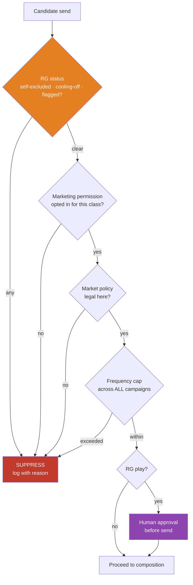

**The rule that matters most: suppression is evaluated immediately before send, never at trigger time.** A player can self-exclude between a trigger firing on Monday and a message going out on Wednesday, which makes Monday's check worthless.

**Hard consequence for onboarding:** the operator's RG status must be readable **synchronously at send time**. A tenant who can only supply it as a nightly export cannot run proactive plays at any price.

**RG outreach is never automated.** The system identifies the candidate and drafts nothing; a trained human decides whether and how to make contact. Automating a wellbeing intervention is the wrong side of a line we should not approach.

**Interface**

```
gate(CandidateSend) -> Allow | RequireHumanApproval | Suppress(reason)
```

**Failure behaviour.** If RG status cannot be read, **suppress**. The default is always "do not contact."

---

## 4.25 Voice Adapter *(V3)*

**Purpose.** Speech in, speech out, through the same pipeline.

**Requirements**

- Support voice as another channel, using the same procedures and the same safety checks.

**Design.** Streaming speech-to-text plus prosody feature extraction produce the canonical event. The pipeline is unchanged. Streaming text-to-speech renders the reply.

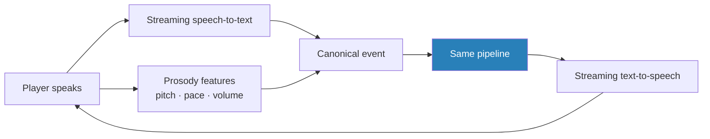

**What voice adds**

| Addition | Why |
|---|---|
| Prosody as a second emotion signal | Tone of voice carries distress a transcript does not |
| Spoken variants of approved wording | Copy written for reading does not work spoken; each needs a human-reviewed spoken form per market |
| Barge-in handling | A player interrupting must stop playback and be processed. Silence-as-consent is unacceptable on an RG-sensitive channel |
| Transcription confidence | A low-confidence transcript lowers effective classification confidence — misheard speech must not become a confident wrong answer |
| Audio retention policy | Audio is personal data with its own profile |

**The hard constraint — latency.** Conversational turn-taking tolerates roughly 1.2 seconds against the 3 seconds chat allows.

```
Streaming speech-to-text (partial) .....  continuous
Classification .........................  < 200 ms   (vs 400 ms in chat)
Connector reads (parallel) .............  < 400 ms
Composition, first token ...............  < 400 ms
Speech synthesis, first audio ..........  < 200 ms
────────────────────────────────────────────────────
First audible response .................  < 1.2 s
```

Consequences: classification runs on **partial transcripts** as the player speaks with a final pass on completion; composition streams into synthesis so audio starts before the sentence finishes; and **procedures needing more than two parallel reads are not voice-eligible** — voice eligibility becomes a procedure attribute checked at author time, like any other capability.

**Why voice is last.** It compresses every existing budget, adds an emotion channel needing separate calibration, and doubles the approved-wording surface. It amplifies the rest of the system rather than adding a new capability, so building it before calibration is stable would mean tuning two things at once and learning from neither.

---

# Part 5 — Cross-cutting concerns

## 5.1 Multi-tenancy and isolation

**Requirements**

- Operators are separated at the database level. No possible query returns one operator's player data to another.
- Operator credentials are encrypted and never logged, and can be revoked individually.
- We request the narrowest access possible — read-only until the action release.
- One operator's traffic spike must not slow another's.
- Where data is stored is configurable per operator and per market.

**Design — regional cells plus logical tenancy.**

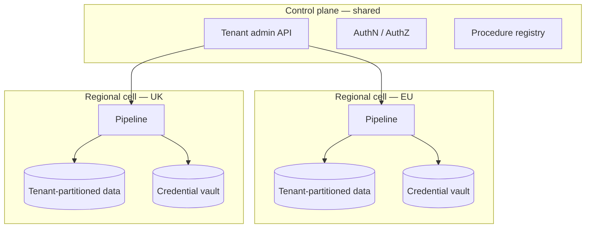

Data residency forces regional deployment anyway, which makes stronger isolation cheaper than it first appears: a tenant's data never leaves its cell, and a tenancy bug's blast radius is one region rather than the platform.

Within a cell, isolation is enforced **at the data access layer**, not in application code. Every query carries a tenant scope; a query without one **fails closed** rather than returning everything. This is the single most important line of code in the system and is tested as such.

| Surface | Isolation |
|---|---|
| Player and conversation data | Row-level tenant partition, enforced at the data layer |
| Read credentials | Per-tenant vault, encrypted, individually revocable |
| **Write credentials** *(V2)* | **Separate vault entry, separately granted and revoked** |
| Procedures | Per-tenant, from a canonical baseline with narrow overrides |
| Knowledge index and approved wording | Per-tenant, per-market |
| Configuration | Per-tenant |
| Action authority *(V2)* | Per-tenant × per-procedure × per-action |
| Suppression sources *(V3)* | Per-tenant, read live, never cached beyond a short window |
| Model prompt cache | Cache key includes tenant — no cross-tenant prefix sharing |
| Kill switches | Tenant and global; conversational and action switches independent |

**Credential escalation at V2** is deliberate friction: a separate, explicit write grant with its own approval and its own vault entry. Silently widening an existing credential's scope would make *"when did this system gain the ability to move money?"* unanswerable.

## 5.2 State and data model

**Per-conversation state**

```
tenant · conversation_id · channel · player_ref
status                  active | handed_over | closed | suppressed
last_processed_message
reply_count
procedure_stack         [{procedure, version, run, state}]
intent_history · confidence_history
emotion_trajectory      rolling window across turns
repeat_contact_count
escalation_reason
disclosure_sent
pending_actions         [{action_id, state}]        (V2)
assist_mode             suggestions instead of sends (V2)
```

`handed_over` is one-way. Only an explicit human hand-back reopens the conversation to the agent.

## 5.3 Latency budgets

```
Chat (V1 / V2)
  Ingress + orchestrator + state ......  <  100 ms
  Deterministic gates .................  <   20 ms
  Classification (cached prefix) ......  200 – 400 ms
  Connector reads (parallel) ..........  300 – 1500 ms
  [V2] guardrails + action + verify ...  400 – 2000 ms
  Composition (~300 tokens) ........... 1500 – 3000 ms
  Post-gate ...........................  <  300 ms
  ────────────────────────────────────────────────
  First visible response ..............  < 3 s at p95
  Substantive answer ..................  < 8 s at p95
  Action-confirming answer ............  < 11 s at p95
  Hard ceiling, then escalate .........   15 s

Voice (V3) ............................  < 1.2 s per turn
```

Three levers hold the chat budget: parallel connector reads, streaming composition, and cached prompt prefixes.

## 5.4 Failure and degradation

**Every degraded path ends with a human holding the conversation and enough context to continue.**

| Failure | Behaviour |
|---|---|
| Classification model down | Deterministic screening still runs; escalate. Never proceed unclassified |
| Composition model down | Escalate. Never silently drop to a cheaper tier for player-facing text |
| Operator systems down | Truthful escalation. Never guess a status |
| Latency ceiling breached | Escalate with gathered context |
| Post-gate rejects | Escalate and raise a high-severity alert |
| Action outcome ambiguous *(V2)* | Freeze the run and escalate. Never blind-retry |
| RG status unreadable *(V3)* | Suppress the send |
| Configuration unavailable | Escalate. Never run on defaults |

## 5.5 Observability

| Surface | Contents | Phase |
|---|---|---|
| Tenant dashboard | Volume, automation rate, escalation rate and reasons, satisfaction, response and resolution times, confidence spread, top topics | V1 |
| Outcome write-back | Topic, confidence, escalation reason written into the operator's own help desk | V1 |
| Financial reporting | Contacts handled, agent hours saved, cost per contact — from metered actuals | V1 |
| Quality review queue | Stratified sample into human review; corrections become procedure edits | V1 |
| Per-market emotion reporting | Band distribution and escalation outcomes per market, to tune calibration against real data | V1 |
| Alerting | Confidence drift, escalation spikes, RG anomalies, emotion drift per language, connector failures, send failures, **cache hit rate** | V1 |
| Action dashboard | Actions by type, value distribution, approval rate, verification mismatches, reversals | V2 |
| Assist metrics | Accept rate, edit distance, resolution-time delta | V2 |
| Proactive dashboard | Sends by play, suppression rate **and reason**, opt-out rate, prevented-contact estimate | V3 |
| Internal operations | Per-tenant latency, token spend, cache hit rate, model error rate, cross-tenant incident view | V1 |

**Two metrics that look like nothing and mean everything.** A cache hit rate that drops is a ~36% cost increase with no functional symptom. A suppression rate that drops means either the operator's RG feed broke or our gate did — and both look like "everything is fine" from outside.

---

# Part 6 — Cost model

## 6.1 V1 per conversation

Assumptions: 3 inbound messages after debounce, 2 substantive replies, ~40% escalation, 5% RG secondary confirmations, steady-state caching, list prices.

| Call | Model | Calls | Token shape | Cost |
|---|---|---|---|---|
| Classification | Haiku 4.5 | 3 | 5k cached + 800 fresh in, 200 out | $0.0069 |
| Composition | Sonnet 5 | 2 | 4k cached + 3.5k fresh in, 300 out | $0.0324 |
| Post-gate scan | Haiku 4.5 | 2 | 1.5k in, 50 out | $0.0035 |
| Escalation context pack | Haiku 4.5 | 0.4 | 3k in, 300 out | $0.0018 |
| RG secondary confirm | Sonnet 5 | 0.05 | 2k in, 150 out | $0.0004 |
| Retrieval and embeddings | — | — | — | $0.0005 |
| **Subtotal** | | | | **$0.0455** |
| Cache writes, retries, rehearsals, sampling (+20%) | | | | $0.0091 |
| **V1 model cost per conversation** | | | | **≈ $0.055** |

## 6.2 V2 and V3

Actions add almost no model cost, because execution is deterministic. What changes is the mix.

| Change | Effect |
|---|---|
| Escalation 40% → ~20% | More conversations reach composition (+$0.016 each) |
| Action confirmation | +1 mid-tier call on ~35% of conversations (+$0.006) |
| Approval summaries | +1 small-model call on ~5% (+$0.0002) |
| **Action execution itself** | **$0 — deterministic** |
| Agent-assist | +1 mid-tier call per human turn on ~20% (+$0.008) |
| **V2 model cost per conversation** | **≈ $0.079** |
| Proactive send (V3) | ≈ $0.012 each — no classification, no engine |
| Voice (V3) | ~1.4× chat on models; ~3–4× total once speech services are included |

## 6.3 All-in per tenant

| | V1 · 10k/mo | V1 · 100k/mo | V2 · 100k/mo | V3 · 100k + 50k outreach |
|---|---|---|---|---|
| Model spend | ~$550 | ~$5,500 | ~$7,900 | ~$8,500 |
| Infrastructure | ~$1,400 | ~$4,200 | ~$5,000 | ~$6,200 |
| **Total** | **~$1,950** | **~$9,700** | **~$12,900** | **~$14,700** |
| Per conversation | ≈ $0.20 | ≈ $0.097 | ≈ $0.129 | ≈ $0.098 |
| **Per automated resolution** | ≈ $0.49 | ≈ $0.24 | **≈ $0.17** | ≈ $0.17 |

**Cost per conversation rises ~44% in V2; cost per automated resolution falls**, because automation roughly doubles. That second number is the one to quote to a buyer, and the one to price against.

**Against the human baseline** of roughly $3–5 per contact, the arithmetic is decisive at every phase — and reportable from metered actuals rather than asserted.

## 6.4 Sensitivity

| Scenario | Model cost per conversation |
|---|---|
| V1 base, list prices | $0.055 |
| Sonnet 5 introductory pricing ($2/$10, through 31 Aug 2026) | $0.039 |
| Top tier for all composition | ~$0.095 |
| **Classification cache silently broken** | **~$0.075 (+36%)** |
| V2 with actions | $0.079 |

---

# Part 7 — Risks

## 7.1 All phases

| Risk | Likelihood | Impact | Mitigation |
|---|---|---|---|
| Cross-tenant data exposure | Low | **Critical** | Data-layer enforcement, regional cells, fail-closed queries, dedicated test suite, penetration test before the first live tenant |
| Operator back office cannot serve the reads | **Medium** | High | Capability contracts, per-tenant degradation, capability probe in week 1 |
| Model provider price or behaviour change | Medium | Medium | Gateway abstraction, portable prompts, monthly cost re-derivation from actuals |
| Procedure sprawl; format becomes a programming language | **Medium** | Medium | Fallback-rate metric; non-engineer authoring as a release gate; canonical baseline with narrow overrides |

## 7.2 V1 — the risk is a wrong answer

| Risk | Likelihood | Impact | Mitigation |
|---|---|---|---|
| Emotion gate over-escalates in a non-English market | **Medium** | Medium | Per-market calibration, per-language monitoring, over-escalation as a tracked success metric |
| RG signal missed in a low-resource language | Low | **Critical** | Deterministic patterns OR-ed with model screening; per-language recall measurement; tighter thresholds where only patterns exist |
| Generated text on a forbidden topic | Low | **Critical** | Structural unreachability of the response step, plus post-gate hash verification, plus a red-team corpus in CI with a zero-leak release bar |
| Agent talks over a human | Low | High | One-way handover state, assignment guard, periodic state audit against help-desk assignment |
| Bad answer reaches a player | Medium | High | Confidence gating, grounding requirement, post-gate, kill switch, quality sampling |
| Classification cache silently breaks | Medium | Medium | Cache-hit-rate alerting; verification in staging before launch |

## 7.3 V2 — the risk is a wrong transaction

| Risk | Likelihood | Impact | Mitigation |
|---|---|---|---|
| **Duplicate action from a retry** | **Medium** | **Critical** | Deterministic key, claim-before-execute, reconcile-never-blind-retry, freeze on ambiguity |
| Action executes against stale state | Medium | High | Preconditions re-verified against live state at execution time |
| Silent no-op looks like success | Medium | High | Outcome verification; mismatch freezes the run |
| Ceiling misconfiguration issues excessive value | Low | **Critical** | Layered authority, aggregate daily caps, dual control, staged rollout from low ceilings |
| Write credentials over-scoped | Low | **Critical** | Separate grant, separate vault entry, independently revocable, per-action scoping |
| Operator cannot accept an external reference | Medium | High | Becomes a write-capability criterion — reconciliation is impossible without it |
| V2 enabled before V1 accuracy is proven | Medium | **Critical** | Hard entry criteria — an accuracy gate, not a date |

## 7.4 V3 — the risk is a wrong recipient

| Risk | Likelihood | Impact | Mitigation |
|---|---|---|---|
| **Outreach to a self-excluded player** | Low | **Catastrophic** | Suppression at send time, live RG read required as a capability, every suppression logged as evidence |
| Player self-excludes between trigger and send | **Medium** | **Catastrophic** | Precisely why the gate sits at send time |
| Marketing message misclassified as service | **Medium** | High | Play template declares its class; validation enforces it; bonus-bearing is marketing by definition |
| Inducement-rule breach in a market | Medium | High | Per-market policy gate, approved templates per market, one play at a time |
| Frequency fatigue and opt-outs | Medium | Medium | Cross-campaign capping, opt-out rate monitored |
| RG outreach automated by accident | Low | **Catastrophic** | Structurally separate lane with mandatory human approval |
| Misheard speech becomes a confident wrong answer | Medium | High | Transcription confidence lowers effective classification confidence; low confidence escalates |

---

# Part 8 — Rollout

## 8.1 Onboarding a tenant

```
V1   Connect help desk → connect back office (read) → map player identity →
     probe read capabilities → adopt procedures → rehearse on real traffic → go live

V2   Grant write scopes → probe write capabilities →
     set authority (ceilings, caps, approval thresholds) →
     rehearse actions in shadow → enable lowest-risk actions → raise ceilings on evidence

V3   Connect signals → import suppression sources → map permissions →
     approve play templates per market → shadow-run triggers (evaluate, do not send) →
     enable one play at a time
```

Rehearsal on real traffic is what makes "days, not weeks" honest rather than optimistic. Every stage is practised on live conversations before it touches a player — and in V2, before it touches an account.

## 8.2 Enabling actions, lowest risk first

```
1. update_ticket           no player-visible effect, no money
2. resend_verification     player-visible, no money, trivially repeatable
3. reset_credential        player-visible, no money, security-reviewed
4. apply_limit             player-protective, one-way but always safe
5. issue_bonus             money out, ceiling-gated, approval above threshold
6. trigger_refund          money out, ceiling-gated, approval above threshold
7. close_account           irreversible, always approved
```

Ceilings start low and rise as verified-outcome history accumulates. A tenant may stop at step 4 indefinitely if that matches their risk appetite.

---

# Appendix A — Glossary

| Term | Meaning |
|---|---|
| **Back office** | The operator's internal system holding accounts, balances, payments, bonuses |
| **Capability** | One specific question we can ask an operator's systems. Operators support different sets |
| **Cooling-off** | A voluntary short break from gambling a player has set |
| **Escalate / hand over** | Give the conversation to a human, with context |
| **KYC** | Identity and document checks gambling operators are legally required to run |
| **AML** | Anti-money-laundering checks, including source-of-funds questions |
| **Inducement** | Wording encouraging further gambling. Regulated; restricted or banned in some markets |
| **Operator** | A gambling company — our customer |
| **Player** | The operator's customer — the person in the conversation |
| **Procedure** | A written, versioned document describing how one kind of question is handled |
| **Rehearsal / dry run** | Running a procedure against real conversations and recording what it *would* have said |
| **RG** | Responsible gambling — protecting players from gambling harm. A legal duty |
| **Self-exclusion** | A player formally barring themselves from gambling, often market-wide |
| **Wagering progress** | How much of a bonus's play-through requirement a player has completed |

# Appendix B — References

**Competitive and market research**
- [How Cevro AI is Transforming iGaming Player Support — iGaming News](https://igaming.news/news/2026-02-24/how-cevro-ai-is-transforming-igaming-player-support)
- [iGaming AI Customer Support — Cevro AI](https://www.cevro.ai/)
- [How to Integrate an AI Agent into Your iGaming Platform — Cevro AI](https://www.cevro.ai/blog/integrate-an-ai-agent-into-your-igaming-platform)
- [Best AI Customer Support Platforms for Sports Betting and Online Gaming (2026) — Lorikeet](https://www.lorikeetcx.ai/articles/ai-customer-support-sports-betting-online-gaming)
- [Responsible gaming with an AI customer service agent — Ada](https://www.ada.cx/blog/responsible-gaming-ai-customer-service-agent/)
- [Conversational AI for Gaming Customer Support — Ada](https://www.ada.cx/industry/gaming/)
- [iGaming AI Agent for Sportsbook & Casino — Symphony Solutions BetHarmony](https://symphony-solutions.com/betharmony)
- [iGaming Customer Support AI Automation 2026 — Symphony Solutions](https://symphony-solutions.com/insights/igaming-customer-support-ai-automation-2026)
- [AI-Powered iGaming & Betting Support Software — Zendesk](https://www.zendesk.com/industries/igaming-and-betting/)
- [AI in iGaming: Use Cases to Watch in 2026 — GR8 Tech](https://gr8.tech/blog/ai-in-igaming-a-look-into-machine-learning-and-personalized-gaming-experiences/)

**Model routing and cost architecture**
- [AI Model Routing Explained: Cut LLM Costs (2026) — Inworld AI](https://inworld.ai/resources/ai-model-routing-cost-reduction)
- [How to Use Model Routing to Cut AI Agent Costs by 60% — MindStudio](https://www.mindstudio.ai/blog/model-routing-cut-ai-agent-costs)
- [LLM Model Routing in 2026: Cost-Quality Optimization — Digital Applied](https://www.digitalapplied.com/blog/llm-model-routing-2026-cost-quality-optimization-engineering-guide)
- [AI Agent Model Routing and Dynamic Model Selection Strategies — Zylos Research](https://zylos.ai/research/2026-03-02-ai-agent-model-routing/)
- [AI Agent Cost Optimization: Token Economics and FinOps in Production — Zylos Research](https://zylos.ai/research/2026-02-19-ai-agent-cost-optimization-token-economics/)

**Model pricing** — Anthropic catalogue, August 2026: Claude Haiku 4.5 $1/$5, Claude Sonnet 5 $3/$15 (introductory $2/$10 through 31 Aug 2026), Claude Opus 5 $5/$25 per million tokens. Cache reads ~0.1× input; cache writes 1.25× at 5-minute TTL. Batch processing −50%. Minimum cacheable prefix: Opus 5 512 tokens, Sonnet 5 1,024, Haiku 4.5 4,096.

# Appendix C — Open questions

1. **Which chat channels and help desks.** Determines adapter implementations. The design is adapter-neutral; the choice is the next discussion.
2. **How different operator back offices are.** Can they serve the reads? **And for V2: can they accept an external reference on writes?** Without one, reconciliation is impossible and write capabilities cannot be granted.
3. **Where models run and where data lives.** The regional-cell design assumes residency constraints; confirm the jurisdictions.
4. **What counts as verifying identity**, per jurisdiction.
5. **How procedures are authored** — a text format, a generated UI, or structured prose. Decides whether non-engineer authoring is real or aspirational, and it is also the demo that wins deals.
6. **First customer.** A single-market first tenant is a materially easier V1.
7. **Pricing model.** Note that cost per automated resolution is the metric that improves across phases, and the one to price against.
8. **V3 only: can the first tenant supply RG status synchronously at send time?** If not, proactive plays are unavailable to them at any price.
